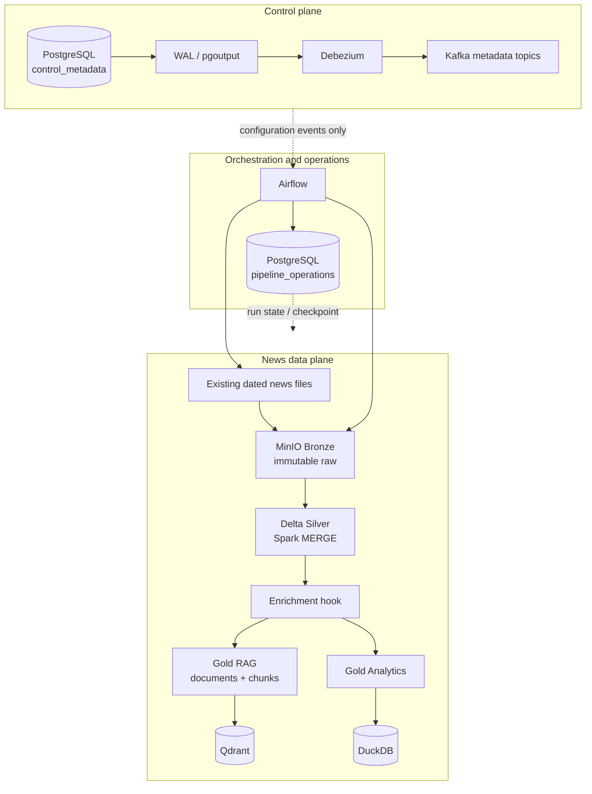

# Financial News Data Platform / ViFinNER

Nền tảng dữ liệu tin tức tài chính tiếng Việt phục vụ khóa luận, với pipeline lakehouse chạy local đã được kiểm chứng từ dữ liệu CafeF có sẵn trong repository.

Luồng chính hiện tại:

```text
Existing CafeF data
  -> MinIO Bronze
  -> Spark cleaning / normalization / deduplication
  -> Delta Lake Silver
  -> enrichment hook
  -> Gold RAG + Gold Analytics
  -> Qdrant + DuckDB
```

Airflow điều phối các job độc lập. PostgreSQL, Debezium và Kafka tạo control plane cho metadata cấu hình. Pipeline hỗ trợ incremental processing, backfill, reprocess, resume, checkpoint, reconciliation và health check.

> Crawler không thuộc luồng triển khai hiện tại. Kafka Phase 04 chỉ truyền metadata điều khiển; nội dung bài báo không đi qua Kafka.

## Mục lục

- [Phạm vi và trạng thái](#phạm-vi-và-trạng-thái)
- [Kiến trúc](#kiến-trúc)
- [Dữ liệu hiện có](#dữ-liệu-hiện-có)
- [Yêu cầu môi trường](#yêu-cầu-môi-trường)
- [Khởi động nhanh](#khởi-động-nhanh)
- [Chạy pipeline độc lập](#chạy-pipeline-độc-lập)
- [Incremental, backfill và recovery](#incremental-backfill-và-recovery)
- [Airflow](#airflow)
- [Metadata CDC](#metadata-cdc)
- [Kiểm thử](#kiểm-thử)
- [Cấu hình](#cấu-hình)
- [Cấu trúc repository](#cấu-trúc-repository)
- [Kết quả đã kiểm chứng](#kết-quả-đã-kiểm-chứng)
- [Giới hạn hiện tại](#giới-hạn-hiện-tại)
- [Tài liệu](#tài-liệu)

## Phạm vi và trạng thái

### Pipeline đang được hỗ trợ

| Phase | Thành phần | Trạng thái |
|---|---|---|
| 00 | Profiling dữ liệu và data contracts | Hoàn thành |
| 01 | Existing data → MinIO Bronze → Spark → Delta Silver | Hoàn thành |
| 02 | Silver → Gold RAG/Qdrant và Gold Analytics/DuckDB | Hoàn thành |
| 03 | Airflow orchestration | Hoàn thành |
| 04 | PostgreSQL metadata → WAL → Debezium → Kafka | Hoàn thành |
| 05 | Incremental, idempotency, backfill, recovery, reconciliation, observability | Hoàn thành |
| 06 | Local release candidate và cloud-readiness | Kỹ thuật hoàn thành; release gate `NOT READY` |

Cloud/Azure/Kubernetes migration chưa được thực hiện. Phase 06 chỉ tạo release
local tái lập được, kiểm chứng adapter/config boundary và lập migration manifest.
Release gate hiện chưa đạt vì `.env` có khả năng chứa credential đã từng được
commit. File đã được bỏ khỏi cây Git mới, nhưng chủ repository vẫn phải
revoke/rotate credential và xử lý lịch sử Git trước khi đổi verdict thành
`READY FOR CLOUD MIGRATION`.

Trạng thái chi tiết và bằng chứng kiểm thử nằm trong [docs/agent_tasks/CURRENT_STATUS.md](docs/agent_tasks/CURRENT_STATUS.md).

### Các phần khác trong repository

Repository còn chứa các hướng nghiên cứu và ứng dụng có từ trước:

- `src/model/` và `data/labeled/`: nghiên cứu ViFinNER và dữ liệu NER.
- `src/scraper/`: crawler CafeF, được giữ lại nhưng không tham gia pipeline local hiện tại.
- `src/rag/`, `src/pipeline/`, `src/flows/`: RAG/Prefect đời trước.
- `src/rag/api/` và `frontend/`: FastAPI/React cho ứng dụng tin tức và chatbot.
- `docker-compose.yml`: chứa cả data platform hiện tại và các service ứng dụng/quan sát cũ.

Luồng được kiểm chứng và dùng cho phần data engineering của khóa luận nằm trong `src/news_pipeline/`, `src/pipeline_operations/`, `src/metadata_control/`, `airflow/dags/`, `metadata/` và `operations/`.

Chưa triển khai stock-market streaming, Flink, Power BI, cloud deployment, Kubernetes hay LLM answer generation trong pipeline này.

## Kiến trúc



### Nguyên tắc chính

- **Bronze là bất biến:** giữ nguyên byte nguồn và dùng SHA-256 làm ingestion ID.
- **Silver là nguồn dữ liệu chuẩn hóa:** validation, làm sạch HTML/text, Unicode NFC, timestamp, URL, content hash, deduplication và quality checks chạy bằng Spark.
- **Gold là dữ liệu dẫn xuất bền vững:** Qdrant và DuckDB có thể được tạo lại từ Gold.
- **Airflow chỉ điều phối:** transformation nằm trong các CLI/job độc lập.
- **Kafka là control plane:** không chứa bài báo, chunk hay embedding trong Phase 04/05.
- **Local/cloud tách qua cấu hình:** local dùng MinIO, Docker Compose, PostgreSQL, Qdrant, DuckDB và Spark standalone.

## Dữ liệu hiện có

Nguồn tin tức hiện có trong `data/raw/` đều là CafeF. `vn30.xlsx` là bảng tham chiếu mã/từ khóa, không phải nguồn bài báo thứ hai.

| File | Bản ghi | Vai trò |
|---|---:|---|
| `data/raw/cafef_news_raw_final.json` | 15.457 | Snapshot chuẩn cho pipeline local |
| `data/raw/cafef_news_raw.json` | 11.242 | Snapshot cũ, trùng một phần với file final |
| `data/raw/cafeF_news.json` | 11.242 | Export cũ |
| `data/raw/news_titles.jsonl` | 11.242 | Dữ liệu title dẫn xuất |
| `data/raw/vn30.xlsx` | 30 công ty | Lookup ticker/keyword |
| `data/eval/rag_eval.jsonl` | 35 câu hỏi | Retrieval evaluation |
| `data/labeled/` | nhiều bộ dữ liệu | NER/span research, không phải Bronze news input |

Không cộng số dòng của ba snapshot JSON như ba batch độc lập vì chúng chồng lấp nhau. Data contract đầy đủ nằm tại [docs/data-contracts.md](docs/data-contracts.md); profile máy đọc được nằm tại [artifacts/data-profile.json](artifacts/data-profile.json).

## Yêu cầu môi trường

Luồng chính chạy trong Docker, không yêu cầu cài Spark/Java/Python dependencies trực tiếp lên máy host.

Cần có:

- Docker Engine và Docker Compose v2.
- GNU Make.
- Git.
- Khuyến nghị tối thiểu 8 GB RAM trống và đủ dung lượng cho Docker volumes, Spark JAR/model cache và Delta data.
- Các cổng local cần dùng không bị chiếm.

Kiểm tra:

```bash
docker --version
docker compose version
make --version
```

## Khởi động nhanh

### 1. Chuẩn bị cấu hình

```bash
cp .env.example .env
```

Đổi mọi password `change-me-*`, đặc biệt `METADATA_CDC_PASSWORD`, trước khi
chạy. `.env` đã được bỏ khỏi Git và bị ignore.

Kiểm tra Compose:

```bash
docker compose config --quiet
```

### 2. Bootstrap toàn bộ local platform

```bash
make bootstrap
```

Bootstrap kiểm tra dependency/cấu hình, build image, chờ health thật, tạo bucket,
chạy migration, seed metadata, tạo topic, đăng ký Debezium và khởi tạo Airflow.
Lệnh an toàn khi chạy lại. Lần đầu có thể lâu vì tải image và Spark JAR.

### 3. Chạy release acceptance

```bash
make phase6-acceptance
```

Kết quả tổng hợp ở `artifacts/local-release-report.json`. Dataset acceptance
cô lập không ghi đè collection/DuckDB mặc định. Hướng dẫn đầy đủ:
[docs/local-release.md](docs/local-release.md).

Lệnh trả exit code khác 0 nếu bất kỳ release gate nào chưa đạt. Với trạng thái
hiện tại, các test chức năng đều PASS nhưng report là FAIL do credential còn
trong lịch sử Git; đây là hành vi mong đợi cho đến khi blocker được xử lý.

### 4. Chạy vertical slice CafeF thủ công

```bash
make infra-up
make bronze-ingest
make silver-build
make gold-build
make analytics-build
make qdrant-index INDEX_LIMIT=96
make retrieval-smoke
```

`INDEX_LIMIT=96` phù hợp cho smoke test local. Dùng `INDEX_LIMIT=0` khi muốn embed/index toàn bộ 66.260 chunks của snapshot chuẩn.

Truy vấn DuckDB:

```bash
make analytics-query QUERY='SELECT * FROM news_by_source ORDER BY article_count DESC'
```

Tìm kiếm semantic không gọi LLM:

```bash
make semantic-search QUERY='lãi suất ngân hàng và thị trường chứng khoán'
```

## Chạy pipeline độc lập

Các job Phase 01/02 vẫn chạy riêng được:

```bash
# Bronze immutable raw + manifest
make bronze-ingest

# Bronze -> Silver Delta
make silver-build

# Silver -> Gold documents/chunks
make gold-build

# Silver -> Gold Analytics -> DuckDB
make analytics-build

# Gold chunks -> Qdrant
make qdrant-index INDEX_LIMIT=96
```

Output mặc định:

```text
MinIO bucket: financial-news

bronze/{source}/{ingestion_id}/raw.json
bronze/{source}/{ingestion_id}/manifest.json
silver/{source}/{ingestion_id}/{processing_version}/...
gold/rag/{source}/{ingestion_id}/{processing_version}/{chunker_version}/...
gold/analytics/{source}/{ingestion_id}/{processing_version}/...

Local DuckDB: data/local/analytics.duckdb
Qdrant collection: news_chunks_local_v1
```

Identity ổn định:

```text
ingestion_id = SHA-256(raw source bytes)
article_id   = SHA-256(source + "\n" + canonical_url)
content_hash = SHA-256(normalized article content)
chunk_id     = SHA-256(article_id + content_hash + chunker_version + chunk_index)
point_id     = UUIDv5(embedding model identity + chunk_id)
```

## Incremental, backfill và recovery

Phase 05 dùng logical partition `(source, processing_date)`. `processing_date` là ngày batch được xử lý, không phải `published_at` của bài báo.

### Chuẩn bị service và migration

```bash
make pipeline-services-up
make operations-status
```

Migration tạo schema PostgreSQL `pipeline_operations` với:

- `pipeline_runs`
- `pipeline_stage_runs`
- `pipeline_checkpoints`
- `pipeline_partition_locks`

Các bảng này không thuộc Debezium publication của Phase 04.

### Incremental một partition

```bash
make pipeline-incremental \
  DATE=2026-09-30 \
  SOURCE_FILE=/app/data/raw/cafef_news_raw_final.json \
  RUN_ID=demo-normal-20260930
```

Pipeline hardened thực hiện:

```text
schema validation
  -> Bronze ingest
  -> Silver Delta MERGE
  -> Gold RAG MERGE
  -> Gold Analytics refresh
  -> atomic DuckDB publish
  -> targeted Qdrant upsert/delete
  -> reconciliation
  -> checkpoint commit
```

Reconciliation yêu cầu Qdrant khớp đầy đủ với Gold, vì vậy một run hardened chính thức nên dùng `NEWS_INDEX_LIMIT=0`.

### Backfill

Đặt fixture theo ngày tại `data/partitions/YYYY-MM-DD.json`, sau đó chạy:

```bash
make pipeline-backfill \
  FROM=2026-09-01 \
  TO=2026-09-07 \
  PARTITION_DIR=/app/data/partitions \
  RUN_ID=demo-backfill-20260901-07
```

Khoảng ngày là inclusive. Mọi file trong khoảng phải tồn tại. Backfill không đẩy checkpoint của normal processing.

### Reprocess

```bash
make pipeline-reprocess \
  DATE=2026-09-30 \
  SOURCE_FILE=/app/data/raw/cafef_news_raw_final.json \
  RUN_ID=demo-reprocess-20260930
```

Make target truyền cờ bắt buộc `--force-reprocess`. Reprocess không đẩy normal checkpoint.

### Resume sau lỗi

```bash
make pipeline-status
make pipeline-resume RUN_ID=<failed-run-id>
```

Resume dùng lại cùng run ID, tái sử dụng stage đã thành công và chạy lại stage lỗi/chưa hoàn thành. Runner từ chối resume nếu source hoặc cấu hình xử lý, chunking, embedding không khớp với run đã lưu.

### Reconciliation, rebuild và health

```bash
RUN_ID=manual-reconcile-$(date +%s) make pipeline-reconcile
make qdrant-rebuild INDEX_LIMIT=0
make analytics-rebuild
make pipeline-health
```

`pipeline-health` kiểm tra MinIO, Silver Delta, Qdrant, DuckDB, PostgreSQL, Kafka, Debezium và Airflow. Nó cần một current dataset đã publish và toàn bộ các service tương ứng đang chạy.

Runbook chi tiết: [docs/pipeline-operations.md](docs/pipeline-operations.md).

## Airflow

Airflow 2.11.2 chạy LocalExecutor với PostgreSQL riêng.

```bash
make airflow-up
make airflow-dags
```

Mở <http://localhost:8088>.

Credentials local mặc định nếu chưa override trong `.env`:

```text
username: airflow
password: airflow
```

Các DAG:

| DAG | Vai trò |
|---|---|
| `news_silver_pipeline` | Bronze/Silver và quality gate; trigger Gold sau khi thành công |
| `news_gold_pipeline` | Gold RAG/Qdrant và Gold Analytics/DuckDB |
| `news_incremental_pipeline` | Incremental/backfill/reprocess/resume qua standalone runner Phase 05 |

DAG incremental mặc định không có schedule vì repository chỉ chứa static sample. Chỉ bật lịch khi đã có fixture theo ngày:

```bash
AIRFLOW_NEWS_INCREMENTAL_SCHEDULE='@daily' make airflow-up
```

Smoke và kiểm thử:

```bash
make airflow-test
make pipeline-run
make airflow-test-silver
make airflow-test-gold
make airflow-logs
```

Trigger incremental DAG với fixture có sẵn:

```bash
docker compose run --rm airflow-cli python3 /app/tools/airflow_smoke.py \
  news_incremental_pipeline --timeout 900 \
  --conf '{"mode":"incremental","processing_date":"2026-07-01","source_file":"/app/data/partitions/2026-07-01.json","pipeline_run_id":"airflow-demo-20260701"}'
```

Chi tiết: [docs/airflow-local.md](docs/airflow-local.md).

## Metadata CDC

Control plane Phase 04:

```text
PostgreSQL control_metadata
  -> logical replication / pgoutput
  -> Debezium connector metadata-control-plane
  -> Kafka compacted topics
```

Khởi động và kiểm tra:

```bash
make metadata-up
make metadata-db-status
make debezium-status
make kafka-topics
make metadata-consume
```

Các bảng được capture:

- `control_metadata.news_sources`
- `control_metadata.pipeline_configs`

Các topic:

- `platform.control_metadata.news_sources`
- `platform.control_metadata.pipeline_configs`

Publication/slot/connector:

```text
publication: metadata_cdc_publication
slot:        metadata_cdc_slot
connector:   metadata-control-plane
snapshot:    initial
```

Chạy lifecycle và recovery test đầy đủ:

```bash
METADATA_CDC_PASSWORD='<local-development-secret>' make metadata-cdc-test
```

Test chứng minh initial snapshot, INSERT, UPDATE before/after, DELETE, tombstone, Connect restart, Kafka outage recovery và PostgreSQL restart.

Chi tiết: [docs/metadata-control-plane.md](docs/metadata-control-plane.md).

## Kiểm thử

### Theo từng phase

```bash
# Schema drift check, không tự sửa contract
make data-contracts-check

# Phase 01
make test-pipeline

# Phase 02
make test-gold

# Phase 03
make airflow-test

# Phase 04
METADATA_CDC_PASSWORD='<local-development-secret>' make metadata-cdc-test

# Phase 05 incremental/idempotency
make test-hardening

# Phase 05 backfill/recovery/schema drift
make test-recovery

# Tổng hợp Phase 05
make phase5-test

# Phase 06 configuration/unit boundary
make test-release

# CI-friendly selection
make ci-test

# Isolated Bronze -> serving plus disaster/rebuild
make e2e-local

# Final local release gate
make phase6-acceptance
```

Các integration/recovery test khởi động Spark và service Docker thật nên có thể
chạy vài phút. `make ci-test` là selection ngắn hơn; `make phase6-acceptance` là
release gate đầy đủ và có thể mất hơn 10 phút trên máy baseline.

### Artifact bằng chứng

- `artifacts/phase5-integration-results.json`
- `artifacts/phase5-recovery-results.json`
- `artifacts/phase5-performance-baseline.json`
- `artifacts/metadata-cdc-*.json`
- `artifacts/gold-retrieval-smoke-results.json`
- `artifacts/local-release-e2e.json` (generated, ignored)
- `artifacts/local-release-report.json` (generated, ignored)

## Cấu hình

Các giá trị local có default trong Compose và có thể override bằng shell hoặc `.env`.

| Nhóm | Biến chính |
|---|---|
| Environment/storage adapter | `ENVIRONMENT`, `OBJECT_STORAGE_PROVIDER`, `OBJECT_STORAGE_SCHEME` |
| MinIO | `NEWS_STORAGE_ENDPOINT`, `NEWS_STORAGE_ACCESS_KEY`, `NEWS_STORAGE_SECRET_KEY`, `NEWS_STORAGE_BUCKET` |
| Source | `NEWS_SOURCE`, `NEWS_SOURCE_FILE`, `NEWS_PROCESSING_VERSION`, `NEWS_PROCESSING_DATE` |
| Spark | `NEWS_SPARK_MASTER` |
| Chunking | `NEWS_CHUNK_SIZE`, `NEWS_CHUNK_OVERLAP` |
| Embedding | `NEWS_EMBEDDING_PROVIDER`, `NEWS_EMBEDDING_MODEL`, `NEWS_EMBEDDING_DIMENSION` |
| Qdrant | `NEWS_QDRANT_URL`, `NEWS_QDRANT_COLLECTION`, `NEWS_INDEX_LIMIT`, `NEWS_INDEX_BATCH_SIZE` |
| DuckDB | `NEWS_DUCKDB_PATH` |
| Operations DB | `METADATA_POSTGRES_*`, `PIPELINE_OPERATIONS_SCHEMA` |
| CDC | `METADATA_CDC_USER`, `METADATA_CDC_PASSWORD`, `METADATA_CDC_PUBLICATION`, `METADATA_CDC_SLOT` |
| Kafka/Debezium | `KAFKA_BOOTSTRAP_SERVERS`, `DEBEZIUM_CONNECT_URL`, `DEBEZIUM_CONNECTOR_NAME` |
| Airflow | `AIRFLOW_ADMIN_*`, `AIRFLOW_DB_*`, `AIRFLOW_WEB_PORT`, `AIRFLOW_NEWS_INCREMENTAL_SCHEDULE` |

Không hardcode `localhost` trong logic chạy container. Service trong Docker network dùng tên như `minio`, `qdrant`, `postgresql`, `kafka`, `debezium`; `localhost` chỉ dùng từ host qua cổng publish.

### Cổng mặc định

| Service | URL/cổng host |
|---|---|
| MinIO S3 API | `http://localhost:9000` |
| MinIO Console | `http://localhost:9001` |
| Airflow | `http://localhost:8088` |
| PostgreSQL metadata | `localhost:5434` |
| Kafka | `localhost:29092` |
| Debezium Connect | `http://localhost:8083` |
| Qdrant REST | `http://localhost:6333` |
| Qdrant gRPC | `localhost:6334` |
| FastAPI cũ | `http://localhost:8000` |
| Frontend cũ | `http://localhost:3002` |
| Grafana | `http://localhost:3000` |

## Cấu trúc repository

```text
.
├── airflow/dags/               # DAG Phase 03/05
├── artifacts/                  # Kết quả smoke, recovery, performance
├── config/                     # Local/test/future-cloud profiles + version manifest
├── data/
│   ├── raw/                    # CafeF snapshots + VN30 lookup
│   ├── labeled/                # ViFinNER/NER research data
│   ├── eval/                   # RAG evaluation questions
│   └── local/                  # Local generated serving/test files
├── docker/                     # Dockerfiles và service configuration
├── docs/                       # Architecture, contracts, runbooks, phase tasks
├── metadata/migrations/        # PostgreSQL control_metadata migrations
├── operations/migrations/      # PostgreSQL pipeline_operations migrations
├── src/
│   ├── news_pipeline/          # Bronze, Silver, Gold, serving, hardened runner
│   ├── pipeline_operations/    # Run/stage/checkpoint/lock repository
│   ├── metadata_control/       # PostgreSQL/Debezium/Kafka control plane
│   ├── model/                  # ViFinNER research
│   ├── scraper/                # Crawler ngoài scope hiện tại
│   ├── rag/                    # RAG/API modules có từ trước
│   └── flows/                  # Prefect flows có từ trước
├── tests/                      # Unit/integration/recovery/DAG/release tests + fixtures
├── tools/                      # Contract, Airflow smoke và local release helpers
├── docker-compose.yml
└── Makefile
```

## Kết quả đã kiểm chứng

Snapshot chuẩn `cafef_news_raw_final.json`:

| Stage | Kết quả |
|---|---:|
| Raw input | 15.457 records / 83.333.360 bytes |
| Silver valid articles | 12.673 |
| Silver rejects | 25 |
| Duplicate inputs | 2.759 |
| Article mentions | 15.431 |
| Gold documents | 12.673 |
| Gold chunks | 66.260 |
| Analytics daily rows | 1.391 |
| Analytics source rows | 1 |
| Publication-status rows | 2 |

Phase 05 đã chứng minh:

- Rerun cùng partition không tạo logical duplicate.
- `article_id`, `chunk_id` và Qdrant point ID ổn định.
- Article mới, content update và mention-only update chỉ đánh dấu đúng article bị ảnh hưởng.
- Backfill ba partition có thể chạy lại với affected counts `[0, 0, 0]`.
- Qdrant outage không làm mất Gold/DuckDB và không đẩy checkpoint.
- Resume cùng run ID chỉ retry stage cần thiết.
- Reconciliation phát hiện và sửa Qdrant point bị thiếu.
- Schema drift bị chặn trước Bronze.
- Health check đạt 8/8 thành phần.

Phase 06 đã chứng minh trên fixture ổn định:

- 4 raw rows ngày đầu → 2 Silver articles, 1 reject và 1 duplicate.
- Replay cùng byte tạo 0 affected article; batch kế tiếp chỉ thêm 1 article.
- Reconciliation cuối đạt 3 Silver / 3 Gold documents / 3 Gold chunks / 3 Qdrant points / 3 DuckDB articles.
- Gold được dựng lại từ Silver, Qdrant từ Gold RAG, DuckDB từ Gold Analytics.
- Future-cloud template tạo URI ABFSS hợp lệ nhưng không kết nối Azure.
- Audit runtime không có developer path, static container IP hay credential pattern.
- Release audit phát hiện bốn tên biến credential trong `.env` đã commit trước
  đây; giá trị không được in ra log và release gate giữ trạng thái `NOT READY`.

Performance và giới hạn phép đo: [artifacts/phase5-performance-baseline.json](artifacts/phase5-performance-baseline.json).

## Dừng và dọn môi trường

Dừng toàn bộ service của local release nhưng giữ volume:

```bash
make local-stop
```

Xóa riêng Qdrant collection và DuckDB mặc định, giữ Bronze/Silver/Gold:

```bash
make reset-derived
```

Reset đầy đủ chỉ xóa dữ liệu/service Phase 01–06 và yêu cầu chuỗi xác nhận:

```bash
make local-reset-destructive CONFIRM=DELETE_LOCAL_RELEASE_DATA
```

Lệnh này không xóa volume của các stack cũ như MongoDB/Prefect/MLflow và giữ
Spark/model cache. Chạy lại `make bootstrap` sau reset.

## Xử lý sự cố thường gặp

### Spark tải dependency lâu ở lần đầu

Delta Lake và Hadoop AWS JAR được lưu trong volume `news_spark_ivy`/`airflow_spark_ivy`. Không xóa volume cache nếu muốn các lần chạy sau nhanh hơn.

### FastEmbed tải model lại

Model cache nằm trong `news_model_cache` hoặc `airflow_model_cache`. Kiểm tra dung lượng Docker volume và kết nối mạng ở lần tải đầu.

### Backfill báo thiếu file

Mọi ngày trong khoảng `FROM..TO` phải có file theo pattern mặc định:

```text
data/partitions/YYYY-MM-DD.json
```

Đường truyền vào Make target là đường nhìn thấy bên trong container, thường bắt đầu bằng `/app/data/...`.

### CDC không đăng ký được connector

Kiểm tra `METADATA_CDC_PASSWORD`, sau đó:

```bash
make metadata-db-status
make debezium-status
docker compose logs --tail=200 postgresql kafka debezium
```

### Airflow DAG không load

```bash
make airflow-dags
make airflow-test
docker compose logs --tail=200 airflow-scheduler airflow-webserver
```

### Health check báo lỗi dù container đang chạy

`pipeline-health` kiểm tra cả service lẫn output hiện tại. Cần chạy migration, publish current Silver/Gold/DuckDB/Qdrant và khởi động Airflow/CDC trước khi health có thể đạt 8/8.

### Port bị trùng

Override cổng trong `.env`, ví dụ `AIRFLOW_WEB_PORT`, `NEWS_MINIO_PORT`, `METADATA_POSTGRES_EXTERNAL_PORT`, `KAFKA_EXTERNAL_PORT` hoặc `QDRANT_EXTERNAL_PORT`.

## Giới hạn hiện tại

- Nguồn news local duy nhất là CafeF.
- Chưa có upstream deletion/tombstone contract cho article; bài đã thấy không bị xóa chỉ vì vắng mặt trong batch sau.
- Gold Analytics đang full refresh có chủ đích vì dataset local còn nhỏ.
- Airflow incremental schedule mặc định tắt cho đến khi có nguồn tạo fixture theo ngày.
- Kafka local là một plaintext broker; Kafka Connect REST không có authentication.
- Qdrant và DuckDB là derived serving stores, có thể tạm thời chậm hơn durable Gold khi service lỗi.
- Chưa có production secret management, TLS, backup, alert routing, Delta retention/VACUUM hay cloud deployment.
- ViFinNER enrichment có interface nhưng chưa bị buộc vào pipeline runtime.
- ADLS byte adapter, Hadoop ABFS runtime và workload identity được hoãn sang Phase 07.
- `.env` cũ vẫn tồn tại trong lịch sử Git. Cần revoke/rotate các credential liên
  quan và quyết định history rewrite hoặc tạo lịch sử sạch trước cloud migration.
- Crawler, stock streaming, Flink, Kubernetes, Terraform, Helm, Power BI, frontend integration và LLM generation không thuộc Phase 06.

## Tài liệu

Đọc theo nhu cầu:

1. [docs/agent_tasks/CURRENT_STATUS.md](docs/agent_tasks/CURRENT_STATUS.md) — trạng thái và bằng chứng mới nhất.
2. [docs/local-architecture.md](docs/local-architecture.md) — kiến trúc local hiện tại.
3. [docs/data-contracts.md](docs/data-contracts.md) — source/Silver/Gold contracts.
4. [docs/pipeline-operations.md](docs/pipeline-operations.md) — incremental, backfill, recovery, reconciliation và health.
5. [docs/airflow-local.md](docs/airflow-local.md) — Airflow setup, DAG và smoke test.
6. [docs/metadata-control-plane.md](docs/metadata-control-plane.md) — PostgreSQL/Debezium/Kafka CDC.
7. [docs/local-release.md](docs/local-release.md) — bootstrap, reset, acceptance, fixture và baseline.
8. [docs/cloud-migration-plan.md](docs/cloud-migration-plan.md) — mapping, ADLS và Kubernetes readiness.
9. [docs/cloud-migration-manifest.md](docs/cloud-migration-manifest.md) — dữ liệu/config/validation/rollback theo component.
10. [docs/local-release-checklist.md](docs/local-release-checklist.md) — release gate `local-rc1`.
11. [docs/decisions.md](docs/decisions.md) — các quyết định kiến trúc.
12. [docs/THESIS_ALIGNMENT.md](docs/THESIS_ALIGNMENT.md) — đối chiếu với đề cương khóa luận.
13. [src/model/docs/README_VI.md](src/model/docs/README_VI.md) — nhánh nghiên cứu ViFinNER.

Xem toàn bộ command đang hỗ trợ:

```bash
make help
```
