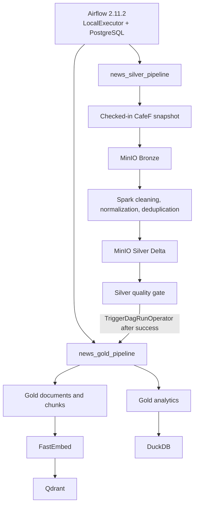

# Phase 03: local Airflow orchestration

Phase 03 adds Apache Airflow as the control layer for the independently runnable Phase 01 and Phase 02 jobs. Airflow does not contain news transformation rules. The DAG tasks call the existing Python modules and Spark scripts, then validate the metrics and artifacts those jobs publish.

## Component decisions

| Component found before Phase 03 | Classification | Decision |
|---|---|---|
| Bronze, Silver, Gold, Qdrant, and DuckDB entrypoints in `src/news_pipeline` | KEEP | Called directly by thin `BashOperator` tasks. |
| MinIO and Qdrant Compose services | KEEP | Reused without a parallel storage or vector stack. |
| Existing PostgreSQL services for Prefect/domain work | KEEP | Left unchanged; Airflow has a separate database and volume. |
| Existing Prefect orchestration | UNUSED FOR NOW | Historical application flow; it does not orchestrate this medallion slice. |
| Airflow image, services, DAGs, plugins, and tests | NEW | No usable Airflow implementation existed before this phase. |
| Custom Airflow operators/hooks | UNUSED FOR NOW | Standard Airflow operators are sufficient. |

No crawler, Kafka, Debezium, Kubernetes, frontend, Power BI, or LLM generation was added.

## Architecture



Airflow 2.11.2 uses `LocalExecutor` with a dedicated PostgreSQL 16 metadata database. This is the smallest local setup that supports parallel Gold tasks reliably; Celery and Redis are unnecessary. The scheduler executes tasks inside an image containing the same Spark 3.5.3, Java 17, Delta/S3 connector coordinates, and Python serving dependencies as the standalone jobs. No Docker socket is mounted.

Both DAGs have `schedule=None`, `catchup=False`, and `max_active_runs=1`. They are manual by default. The Gold DAG allows four active tasks so its RAG and Analytics branches can run in parallel.

## DAGs and dependencies

### `news_silver_pipeline`

```text
start
  -> validate_source_data
  -> bronze_ingest
  -> bronze_quality_check
  -> spark_bronze_to_silver
  -> silver_quality_check
  -> publish_silver_success
  -> trigger_gold_pipeline
```

`publish_silver_success` writes a small status JSON only after the Silver metrics reconcile and all three Delta `_delta_log` paths exist. `TriggerDagRunOperator` then creates `news_gold_pipeline` with the same logical date and upstream run metadata. It waits for Gold to finish, so an end-to-end Silver run reports failure if the triggered Gold run fails. Gold can also be triggered independently for debugging.

### `news_gold_pipeline`

```text
validate_silver
  +-> build_gold_rag_chunks -> embed_and_index_qdrant -> rag_quality_check -----+
  |                                                                          |
  +-> build_gold_analytics -> publish_duckdb -> analytics_quality_check ------+
                                                                              -> publish_gold_success
```

The two branches are independent after `validate_silver`. The final publication task requires both quality gates. No dataset, article, DataFrame, or embedding is passed through XCom; all Bash tasks set `do_xcom_push=False`. Data stays in MinIO, Qdrant, and DuckDB.

## Setup and UI

From the repository root:

```bash
make airflow-up
make airflow-dags
```

Open <http://localhost:8088>. The local bootstrap reads these environment variables:

- `AIRFLOW_ADMIN_USERNAME` (local default `airflow`)
- `AIRFLOW_ADMIN_PASSWORD` (local default `airflow`)
- `AIRFLOW_ADMIN_EMAIL`, `AIRFLOW_ADMIN_FIRSTNAME`, `AIRFLOW_ADMIN_LASTNAME`
- `AIRFLOW_DB_USER`, `AIRFLOW_DB_PASSWORD`, `AIRFLOW_DB_NAME`
- `AIRFLOW_WEBSERVER_SECRET_KEY`, `AIRFLOW_FERNET_KEY`, `AIRFLOW_WEB_PORT`

Set nondefault values in the shell or local `.env` before the first `make airflow-up`. The UI shows both DAG graphs, run history, task states, retries, and task logs. Airflow metadata persists in `airflow_postgres_data`; logs persist in `airflow_logs`.

## Run and test commands

```bash
# Import and structure tests
make airflow-test

# Production-style smoke run through the REST API and scheduler.
# Silver triggers Gold and waits for it.
make pipeline-run

# Trigger either DAG independently and wait for completion
make airflow-test-silver
make airflow-test-gold

# Follow scheduler and webserver logs
make airflow-logs

# Stop Airflow while retaining metadata and caches
make airflow-down
```

The smoke helper creates a unique past logical date, triggers the real scheduler through Airflow's stable REST API, and exits nonzero on DAG failure or timeout. This avoids the duplicate execution race caused by running `airflow dags test` while a scheduler is active. It uses only the configured local Airflow credentials and requires no paid API.

To trigger manually without waiting:

```bash
docker compose run --rm airflow-cli airflow dags trigger news_silver_pipeline
docker compose run --rm airflow-cli airflow dags trigger news_gold_pipeline --conf '{"index_limit": 96}'
```

For failure recovery, inspect the failed task log in the UI, fix the underlying service/configuration issue, select the failed task and use **Clear** with downstream tasks. The DAG's deterministic entrypoints safely rebuild the same logical outputs. Use `make airflow-logs` when the task process did not start or the scheduler/webserver is unhealthy.

## Configuration

The DAG files do not contain hostnames, credentials, bucket names, or transformation settings. Compose supplies the existing configuration surface:

- Storage/source: `NEWS_STORAGE_ENDPOINT`, `NEWS_STORAGE_ACCESS_KEY`, `NEWS_STORAGE_SECRET_KEY`, `NEWS_STORAGE_BUCKET`, `NEWS_SOURCE_FILE`, `NEWS_SOURCE`, `NEWS_PROCESSING_VERSION`
- Spark/Silver: `NEWS_SPARK_MASTER`, `NEWS_SOURCE_INGESTION_ID`, `NEWS_SILVER_ARTICLES_URI`, `NEWS_SILVER_MENTIONS_URI`
- Gold/chunking: `NEWS_GOLD_RAG_PREFIX`, `NEWS_GOLD_ANALYTICS_PREFIX`, `NEWS_CHUNK_SIZE`, `NEWS_CHUNK_OVERLAP`
- Embedding/Qdrant: `NEWS_EMBEDDING_PROVIDER`, `NEWS_EMBEDDING_MODEL`, `NEWS_EMBEDDING_DIMENSION`, `NEWS_QDRANT_URL`, `NEWS_QDRANT_COLLECTION`, `NEWS_INDEX_BATCH_SIZE`, `AIRFLOW_NEWS_INDEX_LIMIT`
- DuckDB: `NEWS_DUCKDB_PATH` inside Airflow is `/opt/airflow/local/analytics.duckdb`
- Airflow capacity: `AIRFLOW_PARALLELISM`

`AIRFLOW_NEWS_INDEX_LIMIT` defaults to 96 for a bounded local real-model smoke run. Set it to `0` to index all 66,260 current chunks. Object storage is already behind `ObjectStore`/configuration, and every job receives URIs and endpoints at startup, preserving the later MinIO-to-ADLS migration boundary.

## Data and status locations

For the canonical snapshot, `<ingestion_id>` is `e374c2b68641e6695fe87227c654bac6ad483d03238ff118d9741976c9642d07`.

| Asset | Location |
|---|---|
| Bronze raw + manifest | `s3a://financial-news/bronze/cafef.vn/<ingestion_id>/` |
| Silver Delta | `s3a://financial-news/silver/cafef.vn/<ingestion_id>/cafef-v1.1/{articles,article_mentions,rejects}` |
| Gold RAG Delta | `s3a://financial-news/gold/rag/cafef.vn/<ingestion_id>/cafef-v1.1/sentence-v1-900-120/{documents,chunks}` |
| Gold Analytics Parquet | `s3a://financial-news/gold/analytics/cafef.vn/<ingestion_id>/cafef-v1.1/` |
| Qdrant | `news_chunks_local_v1` at the configured Qdrant endpoint |
| Airflow DuckDB | Named volume `airflow_duckdb`, file `/opt/airflow/local/analytics.duckdb` |
| Orchestration status | `s3a://financial-news/orchestration/airflow/{silver,gold}/<safe_run_id>.json` |

The status artifact records DAG ID, DAG run ID, logical date, upstream run ID, source, ingestion ID, quality counts, metrics keys, and publication time. Phase 01/02 metrics remain the source for detailed durations and row counts.

## Quality gates, retries, and failure behavior

Quality gates fail on missing objects, missing Delta logs, empty/impossible counts, unreconciled Silver totals, incomplete Qdrant indexing, mismatched Qdrant point count, missing analytical Parquet, inconsistent DuckDB rows, or unreadable DuckDB totals. They reuse existing manifests and metrics and add no academic acceptance threshold.

| Task kind | Retry policy |
|---|---|
| Source/schema and quality validation | No retry; deterministic failures require correction. |
| Bronze object operation | 2 retries, 30 seconds apart. |
| Spark jobs | 1 retry, 1 minute apart. |
| Qdrant Spark index | 1 retry; deterministic point IDs make retry safe. |
| DuckDB publication | 1 retry, 30 seconds apart; publication is atomic. |
| Silver-to-Gold trigger | No retry; the operator waits and surfaces the Gold result. |

All Bash tasks have a two-hour execution timeout.

- Bronze failure blocks Bronze quality, Spark, Silver publication, and Gold trigger.
- Spark failure blocks Silver quality and Gold trigger.
- Silver quality failure blocks the trigger.
- Gold chunking failure blocks embedding/indexing; the Analytics branch may still finish.
- Qdrant failure marks the RAG branch failed; the Analytics branch remains independent and final Gold publication fails.
- DuckDB failure marks the Analytics branch failed; the RAG branch remains independent and final Gold publication fails.

## Verified local evidence

On 23 September 2026, the clean scheduler-managed smoke run `smoke__20260922T192528744000Z__db41bc7a` completed with every task successful:

- Bronze: 15,457 records, 83,333,360 bytes, stable SHA-256 ingestion ID.
- Silver: 12,673 articles, 25 rejects, 2,759 duplicates, 15,431 associations.
- Gold RAG: 12,673 documents and 66,260 chunks; zero empty rejected chunks.
- Qdrant local smoke projection: 96 selected chunks indexed, zero failures, 96 current points.
- Analytics: 12,673 input articles; 1,391 daily rows, 1 source row, 2 publication-status rows.
- Both Gold build tasks started at the same timestamp, demonstrating branch parallelism.
- The triggered Gold run finished `success`; the waiting Silver run then finished `success`.
- A separate scheduler-managed `make airflow-test-gold` run also finished `success`.

Reruns retained the same Bronze ingestion ID, Silver counts, Gold chunk IDs/counts, Qdrant point count, and Analytics/DuckDB totals. Delta writes create new transaction history for rebuilt tables, while logical datasets remain stable. Concurrent publication locking across unrelated manual runs is not implemented; `max_active_runs=1` prevents overlap within each DAG.

## Known limits

- The local DAGs orchestrate the one configured CafeF snapshot. Dynamic per-source DAG generation and crawler scheduling are outside Phase 03.
- Airflow uses local Docker credentials and basic API auth for the smoke helper. Production secret management and remote logging are future deployment work.
- The Airflow DuckDB file is in a Docker volume; the standalone Phase 02 command continues to publish `data/local/analytics.duckdb`.
- FastEmbed model and Spark Ivy caches are separate Airflow volumes on first use.
- PostgreSQL is currently Airflow metadata only. Domain run registry/CDC through PostgreSQL, Debezium, and Kafka belongs to Phase 04.
- Airflow 2.11 reports deprecation notices for the future Airflow 3 migration; they do not affect this local Phase 03 slice.
