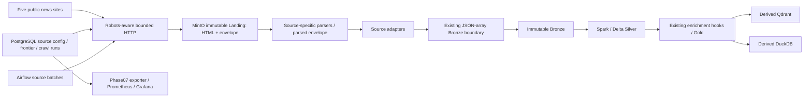

# Local crawler integration architecture

Phase 08 extends the existing platform. The canonical data contract and transformations remain in `docs/data-contracts.md` and `src/news_pipeline`.

Source websites/sections, parser selectors and the actual live smoke inventory
are summarized in [news sources](news-sources.md). Start with
[documentation guide](DOCUMENTATION_GUIDE.md) to choose related documents.

## Responsibility boundaries

- Website discovery, request policy and source parsing belong to the crawler application.
- Each source adapter maps its own raw payload to the existing accepted JSON fields.
- Landing uses `ObjectStore` and `Settings`; no source parser imports MinIO or Spark.
- Bronze/Silver/Gold use their existing implementations. Qdrant and DuckDB remain derived.
- Source config reuses `control_metadata.news_sources.config`. Crawler operational state is separate from the two captured Phase04 metadata tables.
- Kafka carries metadata CDC only. No article queue or CDC-triggered crawl.
- Airflow calls standalone jobs in bounded source batches, never an article task or parser implementation in a DAG.

## Implemented recovery

Landing and adapted batches are immutable, content addressed and stored before advancing a frontier hash. A downstream failure leaves a durable pending batch that can be replayed without refetching the website. A source failure leaves other sources independent. The frontier uses a source-level database lock and bounded work selection, with explicit retry/recheck eligibility and no full-site scans.

## Local scope

MinIO, Docker Compose, PostgreSQL, Spark, Airflow, Qdrant, DuckDB and existing monitoring. No cloud resources or Kubernetes. HTTP accessibility is documented separately from parser validation and downstream acceptance.

## Scheduling and incremental state

The integrated `news_crawling_pipeline` calls standalone `crawl -> publish` jobs for each source; publish reuses the Phase05 runner rather than triggering the dated-file incremental DAG. The default is manual fixture execution. Live scheduling requires both the cron setting and explicit opt-in flag. The DAG uses `Asia/Ho_Chi_Minh`, `catchup=False`, one active run/task and a default limit of one article per source. See [crawler operations](crawler-operations.md#daily-live-scheduling-operator-opt-in) for the daily example, batch-limit behavior and shutdown commands.

Incremental eligibility is driven by persistent canonical URLs, timestamps and observation hashes in PostgreSQL, not just publication date. Changed observations become new batches; unchanged observations create no downstream batch. Source failures and pending downstream batches remain recoverable. A listing-only discovery path and bounded batches do not guarantee complete daily coverage. Gold Analytics still performs the existing full refresh.

Future migration must preserve Landing and the durable medallion hierarchy together with `control_metadata`, `pipeline_operations` and `crawler_operations`. Qdrant/DuckDB can be rebuilt from Gold. ADLS requires an adapter/runtime/identity change; current configuration boundaries do not imply an implemented cloud connection. See [migration manifest](cloud-migration-manifest.md).

## Local acceptance checkpoint

`make phase8-acceptance` returned exit 0 on 2026-10-03. Five source parsers/discovery paths passed offline fixtures, persistent frontier/state tests, the complete local vertical slice and a real all-five-source scheduler run. Explicit tiny live smoke also passed full downstream reconciliation for one article per source (5 articles, 39 chunks/points). Source profiles record the observation date and limitations. See `docs/phase8-engineering-report.md` and `artifacts/phase8-*.json`.

The implementation keeps each source's Qdrant collection and DuckDB serving file separate, matching the existing source-scoped Gold/reconciliation contract. No multi-source serving facade was added. Canonical source is the host; crawler source config uses the five short keys. Historical secret exposure still blocks the cloud-release gate independently of this completed local phase.
