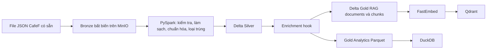
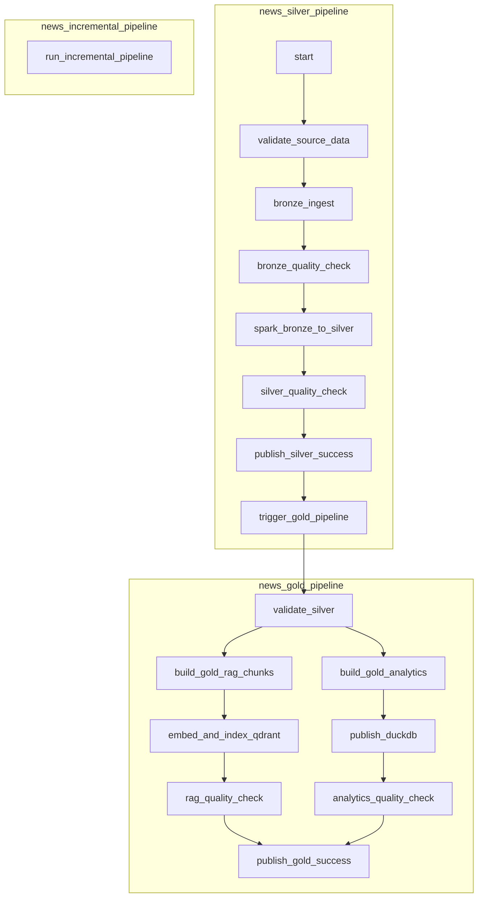
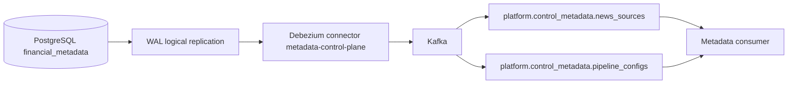
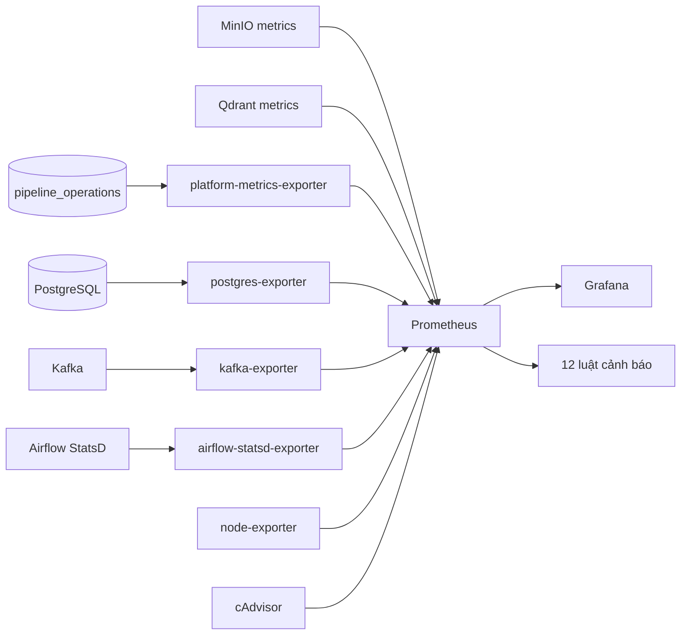

# Hướng dẫn kiến trúc và demo nền tảng dữ liệu tin tức tài chính

Tài liệu này mô tả đúng trạng thái repository sau Phase 07. Phạm vi hiện tại là xử lý dữ liệu tin tức đã có sẵn; crawler, giao diện người dùng, LLM, triển khai Azure và Kubernetes chưa thuộc đường demo này.

> **Nguyên tắc khi demo:** Bronze, Silver và Gold là các lớp dữ liệu bền vững. Qdrant và DuckDB là hệ phục vụ dẫn xuất, có thể dựng lại từ Gold. Kafka ở Phase 04 chỉ truyền thay đổi metadata điều khiển; nội dung bài báo và chunk không đi qua Kafka.

# 1. Tổng quan hệ thống hiện tại

## Trạng thái qua Phase 07

Repository đã có một lát cắt dọc chạy cục bộ gồm:

- nạp file JSON CafeF có sẵn vào Bronze bất biến trên MinIO;
- làm sạch, chuẩn hóa, kiểm tra schema, tạo hash và loại trùng bằng PySpark;
- lưu Silver dưới dạng Delta Lake;
- gọi enrichment hook độc lập với mô hình ViFinNER; hook hiện là passthrough nên không chặn pipeline;
- chia đoạn, tạo embedding bằng FastEmbed và lập chỉ mục Gold RAG vào Qdrant;
- tạo ba bộ tổng hợp Gold Analytics dạng Parquet và phát hành vào DuckDB;
- điều phối các job độc lập bằng Airflow;
- lưu metadata điều khiển và metadata vận hành trong PostgreSQL;
- phát CDC của hai bảng metadata qua WAL, Debezium/Kafka Connect và Kafka;
- xử lý incremental, backfill, reprocess, resume, checkpoint, khóa partition, đối soát và idempotency;
- thu thập metrics bằng Prometheus, hiển thị sáu dashboard Grafana và đánh giá 12 luật cảnh báo.

Dữ liệu CafeF đầy đủ đã được kiểm chứng trong các artifact trước đó gồm 15.457 bản ghi nguồn, 12.673 bài Silver hợp lệ, 25 reject, 2.759 bản trùng, 15.431 mention, 12.673 Gold document và 66.260 chunk. Lát cắt acceptance cô lập của Phase 06 có 3 bài Silver, 3 Gold document, 3 chunk, 3 điểm Qdrant và 3 bài được đối soát trong DuckDB.

## Data Plane

- **MinIO:** object store S3 tương thích cho Bronze, Delta Silver, Gold RAG, Gold Analytics và báo cáo vận hành.
- **PySpark + Delta Lake:** thực thi biến đổi nặng; Spark chạy cục bộ với `local[2]`, Delta Spark 3.2.1 trên Spark 3.5.3.
- **Bronze:** giữ nguyên byte nguồn theo SHA-256, kèm manifest và tham chiếu partition logic.
- **Silver:** chuẩn hóa HTML/text, Unicode NFC, khoảng trắng, thời gian, metadata, URL; sinh `article_id`, `content_hash`; tách reject và loại trùng.
- **Enrichment hook:** điểm nối cho entities, mã cổ phiếu và sự kiện tài chính. Hiện chưa chạy ViFinNER thật.
- **Gold RAG:** document/chunk Delta có ID ổn định; embedding đa ngôn ngữ 384 chiều.
- **Qdrant:** chỉ mục tìm kiếm ngữ nghĩa dẫn xuất, collection mặc định `news_chunks_local_v1`.
- **Gold Analytics:** ba bộ Parquet tổng hợp được commit bằng manifest.
- **DuckDB:** file phục vụ phân tích cục bộ, được phát hành nguyên tử và chỉ cho phép câu lệnh `SELECT` qua CLI.

## Orchestration Plane

Airflow 2.11.2 điều phối ba DAG. DAG chỉ gọi các entrypoint CLI/Python/Spark đã chạy độc lập; logic biến đổi không nằm trong DAG. Silver DAG kích hoạt Gold DAG và chờ Gold hoàn tất. DAG incremental là adapter mỏng cho runner Phase 05.

## Control Plane

PostgreSQL schema `control_metadata` lưu cấu hình nguồn và pipeline. Debezium đọc logical replication từ WAL, dùng publication `metadata_cdc_publication` và slot `metadata_cdc_slot`, sau đó phát sự kiện lên hai topic Kafka. Luồng này không mang nội dung tin tức.

## Operations / Reliability Plane

Schema PostgreSQL `pipeline_operations` lưu run, từng lần chạy stage, checkpoint và khóa partition. Runner hỗ trợ `NORMAL`, `BACKFILL`, `REPROCESS`, `MANUAL`, resume từ stage lỗi, UPSERT ổn định và đối soát chéo Silver/Gold/Qdrant/DuckDB.

## Observability Plane

Exporter của dự án đọc metadata vận hành ở chế độ read-only. Các exporter PostgreSQL, Kafka, Airflow StatsD, MinIO, Qdrant, node exporter và cAdvisor đưa metrics vào Prometheus. Grafana được provision từ file trong repository. Prometheus giữ dữ liệu 7 ngày theo cấu hình mặc định và nạp 12 luật cảnh báo.

# 2. Sơ đồ luồng dữ liệu hiện tại

## Luồng dữ liệu



Các đường dẫn chính:

```text
bronze/{source}/{ingestion_id}/{raw.json,manifest.json}
silver/{source}/{ingestion_id}/{processing_version}/{articles,article_mentions,rejects}
gold/rag/{source}/{ingestion_id}/{processing_version}/{chunker_version}/{documents,chunks}
gold/analytics/{source}/{ingestion_id}/{processing_version}/{dataset,manifest.json}

silver/current/{source}/{processing_version}/...
gold/current/rag/{source}/{processing_version}/{chunker_version}/...
gold/current/analytics/{source}/{processing_version}/...
```

Với snapshot CafeF hiện có, `ingestion_id` đã ghi nhận là `e374c2b68641e6695fe87227c654bac6ad483d03238ff118d9741976c9642d07`.

## Luồng điều phối



`news_incremental_pipeline` nhận mode `incremental`, `backfill`, `reprocess` hoặc `resume`, rồi gọi `src/news_pipeline/airflow_runner.py`. Lịch mặc định là tắt; có thể cấu hình bằng `AIRFLOW_NEWS_INCREMENTAL_SCHEDULE`.

## Metadata control plane



Hai bảng được capture là `control_metadata.news_sources` và `control_metadata.pipeline_configs`. Key ổn định lần lượt là `source_id` và `config_id`. `REPLICA IDENTITY FULL` cho phép event UPDATE/DELETE có dữ liệu trước thay đổi. Connector dùng `snapshot.mode=initial`, JSON không kèm schema, và bật tombstone sau DELETE.

## Quan sát hệ thống



# 3. Danh mục service

| Service | Tên Compose | Mục đích | Cổng host | URL/điểm truy cập cục bộ | Health check | Cần cho demo? |
|---|---|---|---:|---|---|---|
| MinIO | `minio` | Bronze/Silver/Gold và artifact object | 9000, 9001 | API `http://localhost:9000`; Console `http://localhost:9001` | `/minio/health/ready` | Có |
| Spark job image | `news-pipeline` | Chạy job PySpark/Delta theo yêu cầu | — | Không có UI; container one-shot | Kết quả exit code/job | Có |
| Airflow metadata DB | `airflow-postgres` | Metadata riêng của Airflow | Không publish | Nội bộ `airflow-postgres:5432` | `pg_isready` | Có khi demo Airflow |
| Airflow init | `airflow-init` | Migration DB và tạo tài khoản UI | — | Container one-shot | Exit 0 | Có khi bootstrap |
| Airflow scheduler | `airflow-scheduler` | Lập lịch và điều phối DAG | Không publish | Nội bộ | `airflow jobs check` | Có |
| Airflow webserver | `airflow-webserver` | UI Airflow | 8088 | `http://localhost:8088` | `/health` | Có |
| PostgreSQL metadata | `postgresql` | `control_metadata` và `pipeline_operations` | 5434 | PostgreSQL `localhost:5434/financial_metadata` | `pg_isready` | Có |
| Kafka | `kafka` | Bus CDC metadata | 29092 | `localhost:29092` | `kafka-topics --list` | Có cho CDC |
| Kafka Connect/Debezium | `debezium` | Đọc WAL và phát CDC | 8083 | `http://localhost:8083` | TCP cổng 8083 | Có cho CDC |
| Metadata tools | `metadata-tools` | Migration, connector, consumer, smoke test | — | Container one-shot | Exit code | Có cho CDC |
| Qdrant | `qdrant` | Chỉ mục semantic dẫn xuất | 6333, 6334 | API/dashboard `http://localhost:6333/dashboard` | TCP cổng 6333 | Có cho RAG |
| Pipeline exporter | `platform-metrics-exporter` | Metrics pipeline, chất lượng, freshness, CDC | 9108 | `http://localhost:9108/metrics`; `/health` | HTTP `/health` | Có cho monitoring |
| PostgreSQL exporter | `postgres-exporter` | Metrics PostgreSQL | 9187 | `http://localhost:9187/metrics` | Prometheus target | Có cho monitoring |
| Kafka exporter | `kafka-exporter` | Topic offset và consumer lag | 9308 | `http://localhost:9308/metrics` | Prometheus target | Có cho monitoring |
| Airflow StatsD exporter | `airflow-statsd-exporter` | Chuyển Airflow StatsD sang Prometheus | 9102 | `http://localhost:9102/metrics` | Prometheus target | Có cho monitoring |
| Prometheus | `prometheus` | Lưu/query metrics và đánh giá alert | 9090 | `http://localhost:9090` | `promtool check healthy` | Có |
| Grafana | `grafana` | Sáu dashboard được provision | 3000 | `http://localhost:3000` | `/api/health` | Có |
| cAdvisor | `cadvisor` | Metrics cgroup/container | 8080 | `http://localhost:8080` | Prometheus target | Có cho dashboard tài nguyên |
| Node exporter | `node-exporter` | CPU, RAM, network, filesystem host | 9100 | `http://localhost:9100/metrics` | Prometheus target | Có cho dashboard tài nguyên |

`airflow-cli` là service profile one-shot dùng cho lệnh kiểm tra. `Loki`, `Fluent Bit`, `Pushgateway`, MongoDB, Prefect, API và frontend vẫn có cấu hình legacy trong Compose nhưng không thuộc `MONITORING_SERVICES` hay đường Phase 01–07; không cần khởi động hoặc trình bày trong demo này.

# 4. Những service/UI nên mở khi demo

## Nên mở sẵn

1. **Một terminal ở root repository:** chạy lệnh và chỉ ra exit code/artifact.
2. **Airflow — `http://localhost:8088`:** mở Grid/Graph của `news_silver_pipeline`, sau đó chỉ nhánh Gold song song trong `news_gold_pipeline`. Đăng nhập bằng giá trị `AIRFLOW_ADMIN_USERNAME`/`AIRFLOW_ADMIN_PASSWORD` trong `.env`; không đọc mật khẩu trên màn hình.
3. **Grafana — `http://localhost:3000`:** mở dashboard Overview và Pipeline Operations trước. Có thể xem không đăng nhập vì anonymous Viewer đang bật; quyền quản trị dùng biến môi trường.
4. **MinIO Console — `http://localhost:9001`:** mở bucket `financial-news`, chỉ `bronze/`, `silver/`, `gold/`, `operations/`. Không mở toàn bộ file `raw.json` 80 MiB.

## Chỉ mở khi cần

- **Prometheus — `http://localhost:9090`:** tab Targets và Alerts để chứng minh nguồn metrics/alert thực tế.
- **Qdrant — `http://localhost:6333/dashboard`:** xem collection, số point và payload sau khi đã dựng chỉ mục.
- **Kafka Connect REST — `http://localhost:8083/connectors/metadata-control-plane/status`:** xem connector/task `RUNNING`.
- **PostgreSQL shell:** xem hai schema và các run/stage/checkpoint; dùng lệnh trong Demo E.
- **Airflow task log:** mở khi cần chứng minh từng entrypoint được gọi, retry hoặc lỗi.

# 5. Cách khởi động toàn bộ hệ thống

## Chuẩn bị một lần

```bash
cd /home/trongkhoi/financial-news
cp .env.example .env
```

Chỉnh `.env` và thay toàn bộ chuỗi placeholder như `change-me`/`changeme`. Tối thiểu các nhóm sau phải có giá trị cục bộ nhất quán:

- MinIO: `NEWS_STORAGE_ACCESS_KEY`, `NEWS_STORAGE_SECRET_KEY`;
- PostgreSQL/CDC: `METADATA_POSTGRES_PASSWORD`, `METADATA_CDC_PASSWORD`;
- monitoring PostgreSQL: `MONITORING_POSTGRES_PASSWORD`;
- Airflow: `AIRFLOW_DB_PASSWORD`, `AIRFLOW_ADMIN_PASSWORD`, `AIRFLOW_WEBSERVER_SECRET_KEY`;
- Grafana: `GRAFANA_ADMIN_PASSWORD`.

Không commit `.env`. Không dùng credential cloud trong môi trường demo.

## Đường khởi động khuyến nghị

```bash
make bootstrap
make monitoring-up
make monitoring-health
```

`make bootstrap` kiểm tra prerequisite/config/runtime, build image, khởi động MinIO/Qdrant/PostgreSQL/Kafka, khởi tạo storage, chạy migrations, đăng ký Debezium và khởi động Airflow. `make monitoring-up` bổ sung exporter, Prometheus, Grafana, cAdvisor và node exporter. Các bước có tính lặp lại an toàn.

Không dùng `make up` cho buổi bảo vệ vì target này khởi động cả stack legacy ngoài phạm vi Phase 01–07.

## Nếu chỉ tiếp tục từ trạng thái máy đã bootstrap

```bash
make airflow-up
make monitoring-up
make monitoring-health
```

# 6. Kiểm tra trước khi demo

Chạy checklist này trước buổi trình bày, không chờ đến lúc đứng trước hội đồng:

```bash
# Trạng thái container
docker compose ps

# Ba DAG và lỗi import
make airflow-dags

# Health tổng hợp của monitoring
make monitoring-health

# Connector và task phải RUNNING
curl -fsS http://localhost:8083/connectors/metadata-control-plane/status \
  | python3 -m json.tool

# Hai topic dữ liệu CDC phải tồn tại
docker compose exec -T kafka /opt/kafka/bin/kafka-topics.sh \
  --bootstrap-server localhost:9092 --list \
  | grep '^platform\.control_metadata\.'

# Collection Qdrant
curl -fsS http://localhost:6333/collections | python3 -m json.tool

# DuckDB
make analytics-query QUERY='SELECT * FROM vw_news_by_source ORDER BY article_count DESC'

# Prometheus target
curl -fsS http://localhost:9090/api/v1/targets \
  | python3 -c 'import json,sys; d=json.load(sys.stdin); print([(x["labels"].get("job"),x["health"]) for x in d["data"]["activeTargets"]])'
```

Trong MinIO Console, xác nhận bucket `financial-news` có Bronze/Silver/Gold. Trong Grafana, xác nhận đủ sáu dashboard ở mục 16.

Nếu lệnh DuckDB báo file chưa tồn tại hoặc collection `news_chunks_local_v1` chưa có, dựng lại hai projection trước demo:

```bash
make analytics-build
make qdrant-index INDEX_LIMIT=96
```

`96` khớp bộ retrieval smoke nhanh. Dùng `INDEX_LIMIT=0` khi muốn index toàn bộ Gold, nhưng không nên thực hiện ngay trong phiên demo ngắn.

# 7. Kịch bản Demo A — End-to-End Data Pipeline

## Lựa chọn an toàn cho live demo

Chạy lát cắt cô lập đã được thiết kế cho release:

```bash
make e2e-local
python3 -m json.tool artifacts/local-release-e2e.json
```

Luồng thực thi:

1. **Trạng thái đầu:** MinIO và Qdrant khỏe; fixture nằm trong `tests/fixtures/local_release/`.
2. **Input:** hai partition fixture ngày `2026-09-01` và `2026-09-02`.
3. **Bronze:** byte nguồn được ghi bất biến theo SHA-256; cùng byte không tạo raw object mới.
4. **Silver:** Spark kiểm tra, chuẩn hóa và MERGE vào namespace `local-release.test`.
5. **Gold RAG:** sinh document/chunk và ID ổn định.
6. **Gold Analytics:** sinh Parquet/manifest; DuckDB được thay nguyên tử.
7. **Serving:** Qdrant được UPSERT và toàn bộ lớp được reconciliation.
8. **Kết quả kỳ vọng theo artifact chuẩn:** 3 Silver article, 3 Gold document, 3 chunk, 3 Qdrant point, 3 bài trong DuckDB, không ID trùng/missing/orphan.

Xem đầu ra:

- terminal và `artifacts/local-release-e2e.json`;
- MinIO Console, các prefix `bronze/local-release.test`, `silver/current/local-release.test`, `gold/current/.../local-release.test`;
- Qdrant collection `local_release_acceptance_v1`;
- file DuckDB cô lập được báo trong artifact.

**Câu trình bày:** “Đây là cùng logic sản xuất cục bộ đi hết từ dữ liệu nguồn đến hai hệ phục vụ. Bronze, Silver và Gold là dữ liệu bền vững; Qdrant và DuckDB chỉ là projection có thể dựng lại và đã được đối soát.”

Với dữ liệu CafeF đầy đủ, dùng các entrypoint độc lập sau khi có đủ thời gian chuẩn bị:

```bash
make bronze-ingest
make silver-build
make gold-build
make analytics-build
make qdrant-index INDEX_LIMIT=96
```

# 8. Kịch bản Demo B — Airflow Orchestration

## Các bước

```bash
make airflow-up
make airflow-dags
```

Mở `http://localhost:8088`, chọn `news_silver_pipeline`, mở Graph và trigger thủ công. Có thể trigger bằng CLI:

```bash
docker compose run --rm airflow-cli airflow dags trigger news_silver_pipeline
```

Theo dõi Grid/Graph và log từng task. Thành công có nghĩa toàn bộ task Silver màu xanh, `trigger_gold_pipeline` kích hoạt `news_gold_pipeline`, hai nhánh Gold RAG và Gold Analytics chạy song song, rồi cùng hội tụ tại `publish_gold_success`.

Kiểm tra lịch sử bằng CLI:

```bash
docker compose run --rm airflow-cli \
  airflow dags list-runs -d news_silver_pipeline --limit 5
docker compose run --rm airflow-cli \
  airflow dags list-runs -d news_gold_pipeline --limit 5
```

`make pipeline-run` là smoke command có sẵn để trigger Silver và chờ luồng kết thúc. Với snapshot CafeF đầy đủ, thời gian có thể vượt phần trình bày ngắn; nên chạy trước và dùng UI để xem run thành công.

**Lời nói ngắn:** “Airflow ở đây chỉ điều phối. Mỗi ô trên graph gọi đúng job độc lập đã được test. Silver kiểm tra dữ liệu trước khi publish; khi Silver thành công, nó kích hoạt Gold và chờ cả nhánh tìm kiếm lẫn nhánh phân tích hoàn tất.”

# 9. Kịch bản Demo C — Semantic Retrieval / Qdrant

## Chuẩn bị và truy vấn

```bash
make qdrant-index INDEX_LIMIT=96
make semantic-search \
  QUERY='Masan sử dụng dòng vốn hiệu quả khai thác đa dạng kênh dẫn vốn'
```

Đây là query có trong `tests/fixtures/gold_retrieval_queries.json`, được đánh giá trên 96 chunk đầu theo thứ tự ổn định. Artifact `artifacts/gold-retrieval-smoke-results.json` ghi nhận cả 3/3 query đạt expected article trong top 5; với query trên, bài kỳ vọng là “Masan sử dụng dòng vốn hiệu quả, khai thác đa dạng kênh dẫn vốn”. Không coi thứ hạng/score cũ là kết quả bắt buộc cho mọi phiên bản thư viện embedding.

Luồng giải thích:

```text
Silver → Gold document/chunk → FastEmbed 384 chiều → Qdrant UPSERT → query vector → top-k
```

Chỉ vào các trường trả về thực tế: `score`, `chunk_id`, `article_id`, `chunk_index`, `text`, `title`, `source`, `source_url`, `published_at`, `stock_symbols`, `entities`, `processing_version`, `source_ingestion_id`, `embedding_model`.

**Câu trình bày:** “ID point là UUIDv5 từ model và chunk ID nên index lặp lại là UPSERT ổn định. Qdrant có thể mất và được dựng lại từ Gold, vì vậy Qdrant không phải nguồn sự thật.”

# 10. Kịch bản Demo D — Analytics / DuckDB

## Dựng và truy vấn

```bash
make analytics-build

make analytics-query \
  QUERY="SELECT table_name, table_type FROM information_schema.tables WHERE table_schema='main' ORDER BY table_name"

make analytics-query \
  QUERY='SELECT * FROM vw_news_by_source ORDER BY article_count DESC'

make analytics-query \
  QUERY='SELECT publication_status, SUM(article_count) FROM vw_news_publication_status GROUP BY 1 ORDER BY 1'
```

Các table và view thực tế:

| Table | View | Ý nghĩa |
|---|---|---|
| `news_daily` | `vw_news_daily` | Số bài và trung bình số ký tự theo nguồn/ngày xuất bản Việt Nam |
| `news_by_source` | `vw_news_by_source` | Tổng bài, số ngày parse được/không parse được, độ dài trung bình theo nguồn |
| `news_publication_status` | `vw_news_publication_status` | Số bài theo nguồn và trạng thái `parsed`/`unparsed` |

CLI mở DuckDB read-only và chỉ nhận câu lệnh bắt đầu bằng `SELECT`. Kế hoạch Phase 02 từng nêu `vw_news_by_category`, nhưng code hiện tại không tạo view này; không trình bày nó.

**Câu trình bày:** “Gold Analytics được materialize thành Parquet trong MinIO trước. DuckDB đọc đúng các object đã commit trong manifest, kiểm tra row count rồi thay file hoàn chỉnh bằng thao tác nguyên tử.”

# 11. Kịch bản Demo E — Metadata CDC

## Kiểm tra nền

```bash
curl -fsS http://localhost:8083/connectors/metadata-control-plane/status \
  | python3 -m json.tool
```

Connector và task phải là `RUNNING`.

Dọn bản ghi demo còn sót từ lần chạy trước **trước khi** mở consumer:

```bash
docker compose exec -T postgresql sh -lc \
  'psql -v ON_ERROR_STOP=1 -U "$POSTGRES_USER" -d "$POSTGRES_DB"' <<'SQL'
DELETE FROM control_metadata.news_sources
WHERE source_id = 'thesis-demo-source';
SQL
```

## Terminal A: consumer bounded, chỉ nghe event mới

```bash
docker compose run --rm metadata-tools \
  python3 -m src.metadata_control.consumer --timeout 90 --max-events 4
```

## Terminal B: INSERT → UPDATE → DELETE an toàn

Chờ Terminal A khởi động consumer, sau đó chạy ba thay đổi sau:

```bash
docker compose exec -T postgresql sh -lc \
  'psql -v ON_ERROR_STOP=1 -U "$POSTGRES_USER" -d "$POSTGRES_DB"' <<'SQL'
INSERT INTO control_metadata.news_sources
  (source_id, source_name, source_type, enabled, base_url, description, config)
VALUES
  ('thesis-demo-source', 'Nguồn demo đồ án', 'news', true,
   'https://example.invalid', 'Bản ghi tạm cho demo CDC',
   '{"purpose":"thesis-demo"}'::jsonb);

UPDATE control_metadata.news_sources
SET enabled = false,
    description = 'Đã cập nhật trong demo CDC'
WHERE source_id = 'thesis-demo-source';

DELETE FROM control_metadata.news_sources
WHERE source_id = 'thesis-demo-source';
SQL
```

Terminal A sẽ quan sát event `insert`, `update`, `delete` và tombstone. Debezium raw op tương ứng là `c`, `u`, `d`; snapshot ban đầu là `r`. Event update có `before`/`after`; delete có key `source_id` ổn định và `before`; tombstone có cùng key và value rỗng. Topic là `platform.control_metadata.news_sources`.

Snapshot `initial` chỉ chạy khi connector chưa có offset thích hợp; seed hiện có được phát với op `r`. Artifact `artifacts/metadata-cdc-smoke.json` là bằng chứng acceptance nếu không muốn xóa offset để biểu diễn snapshot trực tiếp.

## Cleanup lặp lại an toàn

```bash
docker compose exec -T postgresql sh -lc \
  'psql -v ON_ERROR_STOP=1 -U "$POSTGRES_USER" -d "$POSTGRES_DB"' <<'SQL'
DELETE FROM control_metadata.news_sources
WHERE source_id = 'thesis-demo-source';
SQL
```

Không dùng `pipeline_configs` cho bản ghi demo vì có khóa ngoại đến `news_sources` và có thể làm cleanup phức tạp.

# 12. Kịch bản Demo F — Incremental Processing

Cách an toàn nhất là dùng kiểm thử cô lập:

```bash
make test-incremental
python3 -m json.tool artifacts/phase5-integration-results.json
```

Artifact thể hiện:

- partition đầu chèn 2 bài;
- chạy lại cùng logical input có `inserted=0`, `updated=0`, `unchanged=2`, `affected=0`, Qdrant không index lại;
- partition kế tiếp chỉ thêm 1 bài và các lớp hiện có tăng từ 2 lên 3;
- thay đổi nội dung ở URL cũ giữ `article_id`, cập nhật 1 bài, thay chunk cũ và xóa point stale;
- checkpoint chỉ tiến sau khi tất cả stage và reconciliation thành công.

Lệnh vận hành thật cho một partition:

```bash
make pipeline-incremental \
  DATE=2026-10-03 \
  SOURCE_FILE=/app/data/partitions/2026-10-03.json \
  RUN_ID=demo-normal-20261003
make pipeline-status
```

Chỉ chạy lệnh này nếu file ngày tương ứng đã tồn tại trong thư mục được mount. `processing_date` là partition xử lý, không phải `published_at` của bài.

**Bằng chứng cần chỉ:** metrics `affected_article_count`, run/stage status trong PostgreSQL, checkpoint trước/sau, và các ID không đổi của record cũ.

# 13. Kịch bản Demo G — Idempotency

```bash
make test-idempotency
python3 -m json.tool artifacts/phase5-integration-results.json
```

So sánh lần xử lý logic thứ nhất và lần lặp:

- Silver không thêm ID trùng và báo `affected_article_count=0` ở lần lặp;
- Gold không tạo document/chunk mới cho bài không đổi;
- `chunk_id` giữ nguyên vì phụ thuộc `article_id`, `content_hash`, chunker version và index;
- Qdrant dùng point ID ổn định và lần lặp index 0 point bị ảnh hưởng;
- tổng bài trong ba aggregate và DuckDB không tăng giả;
- reconciliation vẫn pass.

Bronze dùng content address nên cùng byte nguồn tái sử dụng object SHA-256. Đối với run `NORMAL` đã ở trước hoặc bằng checkpoint, runner có thể đánh dấu toàn run `SKIPPED`; đây cũng là hành vi mong đợi.

# 14. Kịch bản Demo H — Backfill / Reprocessing

## Khác biệt

| Mode | Mục đích | Checkpoint normal | Điều kiện |
|---|---|---|---|
| `BACKFILL` | Xử lý một khoảng ngày inclusive từ file partition | Không tiến checkpoint normal | Mỗi file trong khoảng phải tồn tại |
| `REPROCESS` | Cố ý chạy lại một partition đã biết | Không tiến checkpoint normal | Bắt buộc `force_reprocess=true`; Make target tự truyền cờ này |

## Demo tự động, cô lập

```bash
make test-backfill
python3 -m json.tool artifacts/phase5-recovery-results.json
```

Artifact hiện có chứng minh backfill `2026-08-01` đến `2026-08-03`, lặp backfill có Silver affected `[0,0,0]`, REPROCESS bắt buộc force, và resume chỉ chạy lại stage lỗi.

## Lệnh operator với namespace demo riêng

```bash
NEWS_SOURCE=thesis-demo.local \
NEWS_PROCESSING_VERSION=thesis-demo-v1 \
NEWS_QDRANT_COLLECTION=thesis_demo_v1 \
NEWS_DUCKDB_PATH=/app/local/thesis-demo.duckdb \
make pipeline-backfill \
  FROM=2026-09-01 TO=2026-09-02 \
  PARTITION_DIR=/app/tests/fixtures/local_release \
  RUN_ID=thesis-demo-backfill-v1

NEWS_SOURCE=thesis-demo.local \
NEWS_PROCESSING_VERSION=thesis-demo-v1 \
NEWS_QDRANT_COLLECTION=thesis_demo_v1 \
NEWS_DUCKDB_PATH=/app/local/thesis-demo.duckdb \
make pipeline-reprocess \
  DATE=2026-09-01 \
  SOURCE_FILE=/app/tests/fixtures/local_release/2026-09-01.json \
  RUN_ID=thesis-demo-reprocess-v1

make pipeline-status
```

Trong `pipeline_operations.pipeline_runs`, chỉ trường `trigger_type` lần lượt là `BACKFILL` và `REPROCESS`; parameters lưu danh sách partition và configuration identity.

# 15. Kịch bản Demo I — Failure and Recovery

## Cách đầy đủ và an toàn đã có sẵn

Sau khi monitoring khỏe:

```bash
python3 tools/phase7_acceptance.py --mode acceptance
python3 -m json.tool artifacts/phase7-acceptance.json
```

Script tự tạo source, processing version, Qdrant collection và DuckDB file riêng theo timestamp. Phần Qdrant thực hiện đúng chuỗi:

1. xác nhận preflight;
2. dừng `qdrant`;
3. chờ Prometheus thấy `up{job="qdrant"}=0` và alert `QdrantDown` firing;
4. chạy fixture `qdrant-recovery.json`, ghi run/stage `FAILED` tại `qdrant_upsert`;
5. xác nhận `PipelineRunFailed` hoặc `QdrantIndexFailure` firing;
6. khởi động Qdrant lại;
7. resume cùng run ID;
8. tái sử dụng các stage upstream đã thành công, retry Qdrant và reconciliation;
9. chờ alert resolve.

Script có `finally` để khởi động lại Qdrant và resume Debezium nếu bị gián đoạn. Không xóa Bronze/Silver/Gold bền vững.

## Chỉ biểu diễn service alert trong demo ngắn

```bash
docker compose stop qdrant
# Chờ ít nhất 20 giây, xem QdrantDown trong Prometheus/Grafana.
docker compose up -d --wait qdrant
# Chờ alert trở về inactive.
```

Không chạy một pipeline trên namespace CafeF chính trong lúc cố ý tắt Qdrant. Nếu cần chứng minh retry stage, dùng script acceptance cô lập phía trên hoặc mở artifact `phase7-acceptance.json` đã PASS.

# 16. Kịch bản Demo J — Monitoring / Grafana

Repository provision đúng sáu dashboard:

## 1. Financial News Platform — Overview

- **Panels:** Critical scrape targets, exporter collection, Airflow scheduler, runs theo status, freshness, active alerts, Qdrant vectors, DuckDB state, CDC connector.
- **Metrics tiêu biểu:** `up`, `financial_news_exporter_collection_success`, `financial_news_pipeline_runs_total`, `financial_news_data_freshness_seconds`, `collections_vector_total`.
- **Nên chỉ:** toàn bộ target quan trọng màu xanh, số run, freshness, trạng thái Qdrant/DuckDB/CDC.

## 2. Financial News Pipeline — Operations

- **Panels:** thời gian end-to-end, thời gian từng stage, tổng run, success ratio, record volumes, Airflow heartbeat, failed attempts.
- **Metrics:** `financial_news_pipeline_last_run_duration_seconds`, `financial_news_pipeline_stage_duration_seconds`, `financial_news_pipeline_stage_runs_total`, `airflow_scheduler_heartbeat`.
- **Nên chỉ:** Silver thường là stage tốn nhiều thời gian nhất; run/stage có nhãn hữu hạn để tránh cardinality cao.

## 3. Financial News Pipeline — Data Quality

- **Panels:** invalid, duplicate, duplicate ratio, quality gate, reconciliation, quan hệ Bronze–Silver và Silver–Gold.
- **Metrics:** `financial_news_data_quality_invalid_records`, `financial_news_data_quality_duplicate_records`, `financial_news_data_quality_duplicate_ratio`, `financial_news_data_quality_gate_pass`, `financial_news_reconciliation_pass`.
- **Nên chỉ:** reject/trùng được đo riêng và các count giữa lớp khớp sau reconciliation.

## 4. Financial News Pipeline — Freshness

- **Panels:** freshness tổng và riêng Bronze, Silver, Gold RAG, Qdrant, Gold Analytics, DuckDB; timestamp thành công cuối.
- **Metrics:** `financial_news_data_freshness_seconds`, `financial_news_data_last_success_timestamp_seconds`.
- **Nên chỉ:** serving projection có freshness riêng với dữ liệu bền vững.

## 5. Metadata Control Plane — CDC

- **Panels:** Kafka broker, PostgreSQL exporter, Debezium connector/task, replication slot active/WAL lag, topic high watermark, consumer lag, tuổi event mới nhất, số partition.
- **Metrics:** `financial_news_kafka_broker_up`, `financial_news_debezium_connector_up`, `financial_news_debezium_task_up`, `financial_news_cdc_replication_slot_active`, `financial_news_cdc_replication_slot_lag_bytes`, `kafka_consumergroup_lag`.
- **Nên chỉ:** CDC là control plane độc lập; Kafka/PostgreSQL vẫn hoạt động khi connector tạm pause.

## 6. Local Infrastructure — Resources

- **Panels:** CPU, RAM, network RX/TX, filesystem còn trống và top cgroup memory.
- **Metrics:** node exporter và `container_memory_working_set_bytes`.
- **Giới hạn:** trên host Docker/cgroup v2 đã kiểm tra, cAdvisor không cung cấp nhãn tên Compose ổn định; panel tài nguyên thể hiện host/cgroup, không khẳng định chi tiết theo service.

# 17. Demo cảnh báo

## Lựa chọn 1: `QdrantDown`

- **Điều kiện:** `up{job="qdrant"} == 0` liên tục 20 giây.
- **Kích hoạt:** `docker compose stop qdrant`.
- **Quan sát:** Prometheus Alerts chuyển pending rồi firing; Grafana Overview tăng Active alerts.
- **Phục hồi:** `docker compose up -d --wait qdrant`; chờ scrape mới và alert inactive.
- **Cleanup:** không cần xóa volume hay dữ liệu.

`ServiceDown` cũng có thể firing cùng lúc vì Qdrant thuộc nhóm critical target; đây là hành vi đúng, không phải hai lỗi độc lập.

## Lựa chọn 2: `DebeziumConnectorDown`

- **Điều kiện:** connector hoặc task metric bằng 0 liên tục 20 giây.
- **Kích hoạt an toàn:** 

```bash
curl -fsS -X PUT \
  http://localhost:8083/connectors/metadata-control-plane/pause
```

- **Quan sát:** connector xuống trong dashboard CDC trong khi Kafka broker và PostgreSQL vẫn up.
- **Phục hồi:** 

```bash
curl -fsS -X PUT \
  http://localhost:8083/connectors/metadata-control-plane/resume
curl -fsS http://localhost:8083/connectors/metadata-control-plane/status \
  | python3 -m json.tool
```

- **Cleanup:** đợi connector/task `RUNNING` và alert inactive.

Các alert còn lại đã cấu hình: `KafkaConsumerLagHigh`, `PipelineRunFailed`, `PipelineNoSuccessfulRunRecently`, `SilverDataStale`, `GoldDataStale`, `QdrantIndexFailure`, `DataQualityGateFailed`, `ReconciliationFailed`, `PostgreSQLReplicationSlotInactive` và `ServiceDown`. Không cố ý gây lỗi replication slot trong buổi demo.

# 18. Ánh xạ metrics với đánh giá đồ án

| Tiêu chí | Bằng chứng hiện đo được | Giới hạn hiện tại |
|---|---|---|
| Tỷ lệ job thành công | `financial_news_pipeline_runs_total` và tỷ lệ SUCCESS/(SUCCESS+FAILED) | Chỉ phản ánh workload cục bộ đã chạy |
| Thời gian xử lý | duration end-to-end và theo stage | Baseline là quan sát mô tả trên một máy, không phải benchmark quy mô cloud |
| Bản ghi không hợp lệ | `financial_news_data_quality_invalid_records`, reject Silver, quality gate | Chất lượng phụ thuộc contract và fixture hiện có |
| Bản ghi trùng | duplicate count/ratio và ID uniqueness | Chưa đánh giá trùng ngữ nghĩa bằng mô hình |
| Độ mới dữ liệu | freshness/timestamp riêng từng lớp | Pipeline hiện là batch; không phải SLA streaming |
| Ổn định và phục hồi | failed stage, alert, retry, resume cùng run ID, checkpoint không tiến khi lỗi | Chưa thử fault injection phân tán hoặc multi-node |
| Tính đúng giữa lớp | `financial_news_reconciliation_pass` và artifact chi tiết | Kiểm tra current-state; chưa có contract tombstone xóa bài nguồn |

Kết quả baseline Phase 07 hiện có 8 mẫu run cô lập, thời gian 39,129–47,058 giây, trung bình 44,147 giây. Chỉ trình bày đây là số đo cục bộ trên dữ liệu fixture và cache đã warm. Đánh giá throughput lớn, autoscaling, độ bền nhiều node, SLA cloud và chi phí cần thử nghiệm tương lai.

# 19. Timeline demo

## Demo 5 phút

1. **0:00–0:45:** sơ đồ năm plane và ranh giới durable/derived.
2. **0:45–1:45:** MinIO Console, chỉ Bronze/Silver/Gold.
3. **1:45–2:45:** Airflow Graph của run thành công Silver → Gold.
4. **2:45–3:45:** chạy semantic query đã chuẩn bị.
5. **3:45–4:30:** query `vw_news_by_source` trong DuckDB.
6. **4:30–5:00:** Grafana Overview/Data Quality, kết luận reconciliation/idempotency.

Không chạy Spark hoặc alert trực tiếp trong phiên 5 phút.

## Demo 10 phút — khuyến nghị

1. **0:00–1:00:** mục tiêu, kiến trúc và data/control plane.
2. **1:00–2:00:** MinIO bucket và phân cấp Bronze/Silver/Gold.
3. **2:00–3:30:** Airflow Graph, task dependencies và run thành công gần nhất.
4. **3:30–5:00:** semantic search Qdrant bằng query Masan.
5. **5:00–6:00:** DuckDB query ba dataset/view.
6. **6:00–7:30:** CDC INSERT/UPDATE/DELETE đã chuẩn bị hoặc mở artifact/status.
7. **7:30–9:00:** Grafana Overview, Operations, Data Quality, Freshness.
8. **9:00–10:00:** artifact idempotency/failure-recovery và giới hạn hiện tại.

Chỉ demo cảnh báo trực tiếp nếu đã kiểm tra trước và có thêm 1 phút đệm.

## Demo 20 phút

1. **0:00–2:00:** kiến trúc năm plane.
2. **2:00–5:00:** `make e2e-local`, trong khi chạy giải thích Bronze/Silver/Gold và xem dữ liệu đã có trong MinIO.
3. **5:00–7:00:** Airflow DAGs và log.
4. **7:00–9:00:** Qdrant query/payload.
5. **9:00–10:30:** DuckDB tables/views.
6. **10:30–13:00:** CDC live INSERT/UPDATE/DELETE.
7. **13:00–15:00:** incremental/idempotency/backfill artifacts và `pipeline-status`.
8. **15:00–18:00:** QdrantDown hoặc DebeziumConnectorDown, phục hồi.
9. **18:00–20:00:** sáu dashboard, metrics đánh giá và giới hạn.

# 20. Kịch bản thuyết trình tiếng Việt

## Mở đầu

“Phần em phụ trách là pipeline dữ liệu tin tức tài chính. Dữ liệu đầu vào hiện là snapshot CafeF đã có sẵn. Hệ thống đưa dữ liệu qua Bronze, Silver và Gold, rồi phục vụ hai nhu cầu: tìm kiếm ngữ nghĩa bằng Qdrant và phân tích bằng DuckDB.”

## MinIO và xử lý dữ liệu

“Bronze giữ nguyên dữ liệu nguồn theo content hash để có thể truy vết. Spark đọc Bronze, kiểm tra schema, làm sạch HTML, chuẩn hóa Unicode, thời gian và URL, sau đó loại trùng và ghi Delta Silver. Gold giữ document/chunk cho RAG và các bảng tổng hợp cho phân tích.”

## Airflow

“Đây là graph điều phối. DAG không chứa logic xử lý nặng mà gọi các job độc lập. Silver phải qua quality gate trước khi kích hoạt Gold. Hai nhánh Qdrant và DuckDB chạy độc lập rồi hội tụ ở trạng thái publish thành công.”

## Qdrant

“Mỗi chunk có ID xác định từ bài, nội dung và cấu hình chunk. Embedding được index bằng point ID ổn định. Truy vấn này trả đúng bài Masan trong bộ smoke test. Qdrant là chỉ mục dẫn xuất nên có thể dựng lại từ Gold.”

## DuckDB

“Ba bảng tổng hợp được tạo trước dưới dạng Parquet trong MinIO. DuckDB chỉ publish sau khi kiểm tra row count và thay file nguyên tử. Đây là lớp phục vụ cho phân tích cục bộ và có thể nối với công cụ BI sau này.”

## CDC

“Kafka ở đây chỉ thuộc control plane. Khi metadata cấu hình thay đổi trong PostgreSQL, Debezium đọc WAL và phát event có key ổn định lên Kafka. Nội dung bài báo không đi qua Kafka trong phase này.”

## Tin cậy và monitoring

“Mỗi run và stage được lưu trong PostgreSQL. Nếu Qdrant lỗi, checkpoint không tiến; khi service phục hồi, runner resume cùng run và tái sử dụng stage upstream đã thành công. Prometheus và Grafana cho thấy duration, chất lượng, freshness, CDC và trạng thái hạ tầng.”

## Kết thúc

“Bằng chứng chính là dữ liệu giữa các lớp được đối soát, job chạy lặp không tạo bản ghi giả, projection có thể dựng lại và lỗi có đường phục hồi. Các số đo hiện tại là baseline cục bộ; kiểm thử quy mô cloud là bước riêng trong tương lai.”

# 21. Những nội dung không nên trình bày

- Không chạy `make up`; nó đưa các service legacy MongoDB/Prefect/API/frontend vào màn hình và làm mờ phạm vi đồ án.
- Không chạy crawler, scraper hoặc dùng `docs/RUNBOOK.md` legacy làm runbook cho pipeline hiện tại.
- Không mở toàn bộ `raw.json` 80 MiB hoặc log Spark quá dài; chỉ xem manifest/count.
- Không index toàn bộ 66.260 chunk ngay trong demo ngắn; chuẩn bị trước hoặc dùng 96 chunk smoke.
- Không xóa Docker volume, không chạy `docker compose down -v`, không chạy `make local-reset-destructive`.
- Không xóa replication slot/publication để ép snapshot CDC; dùng artifact snapshot đã kiểm chứng.
- Không hiển thị `.env`, password, API key hay câu lệnh có credential thật.
- Không cố tình dừng PostgreSQL/Kafka trong demo ngắn; thời gian phục hồi dài hơn và ảnh hưởng nhiều plane.
- Không khẳng định ViFinNER đang enrichment thật; hiện chỉ có interface/passthrough hook.
- Không khẳng định hệ thống đã cloud-ready hoàn toàn: release gate Phase 06 còn vướng remediation credential trong lịch sử Git.
- Không dùng `vw_news_by_category`; view này có trong kế hoạch cũ nhưng không có trong code hiện tại.
- Không trình bày Loki/Fluent Bit/Pushgateway như monitoring Phase 07 bắt buộc; chúng là phần legacy trong Compose.

# 22. Phương án dự phòng khi demo lỗi

| Tình huống | Phương án dự phòng dựa trên repository |
|---|---|
| Airflow run lâu | Mở run thành công trước đó, Graph và task logs; dùng `make airflow-dags` chứng minh DAG/import hợp lệ |
| Spark tải package/model lâu | Mở `artifacts/local-release-e2e.json` và các object MinIO đã sinh |
| Qdrant collection mặc định chưa có | Chạy `make qdrant-index INDEX_LIMIT=96`; nếu không đủ thời gian, mở `artifacts/gold-retrieval-smoke-results.json` |
| Semantic query lỗi do phiên bản model | Trình bày smoke artifact 3/3 và payload/query path; không sửa model giữa buổi |
| DuckDB file chưa có | Chạy `make analytics-build`; nếu vẫn lỗi, chỉ manifest Gold Analytics trong MinIO và artifact E2E |
| Kafka consumer không thấy event | Xác nhận connector status và topic; mở `artifacts/metadata-cdc-smoke.json` cùng `metadata-cdc-recovery.json` |
| Grafana thiếu dữ liệu mới | Chạy `make monitoring-health`, mở Prometheus Targets, dùng `artifacts/phase7-monitoring-checks.json` |
| Alert chưa firing | Chờ đủ `for: 20s` cộng chu kỳ scrape; nếu hết thời gian, mở `artifacts/phase7-acceptance.json` |
| Qdrant bị dừng ngoài ý muốn | `docker compose up -d --wait qdrant`, sau đó `make monitoring-health` |
| Debezium đang pause | Gọi endpoint `/resume`, xác nhận connector/task `RUNNING` |
| `.env` thiếu biến bắt buộc | Dừng demo mutation; dùng UI/artifact đã chuẩn bị. Không tạo password tùy tiện trên sân khấu |

# 23. Cleanup sau demo

## Khôi phục metadata và service

```bash
docker compose exec -T postgresql sh -lc \
  'psql -v ON_ERROR_STOP=1 -U "$POSTGRES_USER" -d "$POSTGRES_DB"' <<'SQL'
DELETE FROM control_metadata.news_sources
WHERE source_id = 'thesis-demo-source';
SQL

curl -fsS -X PUT \
  http://localhost:8083/connectors/metadata-control-plane/resume || true
docker compose up -d --wait qdrant
make monitoring-health
```

Các acceptance test dùng namespace/collection/file riêng. Không xóa dữ liệu bền vững chỉ để làm sạch màn hình. Nếu đã tạo namespace `thesis-demo.local`, giữ lại làm bằng chứng hoặc xóa có chủ đích sau khi sao lưu; repository chưa có target cleanup riêng cho namespace đó.

## Dừng mà vẫn giữ volume

```bash
make monitoring-down
make local-stop
```

Hoặc dừng toàn bộ Compose nhưng vẫn giữ volume:

```bash
docker compose down
```

# 24. Cheat sheet một trang

## Khởi động

```bash
cp .env.example .env              # chỉ lần đầu; điền secret cục bộ
make bootstrap
make monitoring-up
make monitoring-health
```

## URL quan trọng

```text
Airflow:        http://localhost:8088
Grafana:        http://localhost:3000
Prometheus:     http://localhost:9090
MinIO Console:  http://localhost:9001
Qdrant:         http://localhost:6333/dashboard
Kafka Connect:  http://localhost:8083
```

## DAG và service quan trọng

```text
DAG: news_silver_pipeline, news_gold_pipeline, news_incremental_pipeline
Service: minio, news-pipeline, airflow-scheduler, airflow-webserver,
         postgresql, kafka, debezium, qdrant, prometheus, grafana
Connector: metadata-control-plane
Topics: platform.control_metadata.news_sources
        platform.control_metadata.pipeline_configs
```

## Lệnh demo

```bash
make e2e-local
make airflow-dags
make qdrant-index INDEX_LIMIT=96
make semantic-search QUERY='Masan sử dụng dòng vốn hiệu quả khai thác đa dạng kênh dẫn vốn'
make analytics-build
make analytics-query QUERY='SELECT * FROM vw_news_by_source ORDER BY article_count DESC'
make pipeline-status
make test-idempotency
make test-backfill
```

## Health, lỗi và phục hồi

```bash
docker compose ps
make monitoring-health
curl -fsS http://localhost:8083/connectors/metadata-control-plane/status | python3 -m json.tool

docker compose stop qdrant
docker compose up -d --wait qdrant

curl -fsS -X PUT http://localhost:8083/connectors/metadata-control-plane/pause
curl -fsS -X PUT http://localhost:8083/connectors/metadata-control-plane/resume
```

## Dừng

```bash
make monitoring-down
make local-stop
# hoặc: docker compose down
```

# 25. Báo cáo xác minh tài liệu

## File và thành phần đã kiểm tra

- `AGENTS.md`, `README.md`, `Makefile`, `.env.example`, `docker-compose.yml`;
- `docs/data-contracts.md`, `artifacts/data-profile.json`, `docs/agent_tasks/CURRENT_STATUS.md`;
- kế hoạch Phase 01–07 và tài liệu release/operations/monitoring hiện tại;
- Dockerfile pipeline, Airflow, metadata tools;
- cấu hình storage/settings/Gold, Bronze/Silver/Gold/embedding/Qdrant/DuckDB/reconciliation/runner;
- ba DAG trong `airflow/dags/`;
- migrations `metadata/migrations/0001_control_metadata.*.sql` và `operations/migrations/0001_pipeline_operations.*.sql`;
- code connector/topic/consumer/smoke CDC;
- Prometheus scrape config, 12 alert rules, Grafana provisioning và sáu dashboard JSON;
- test/fixture Phase 01–07 và các artifact acceptance/recovery/retrieval.

## Đã xác minh trực tiếp trong phiên lập tài liệu

- `docker compose ps`: MinIO, Airflow, PostgreSQL, Kafka, Debezium, Qdrant, Prometheus, Grafana và exporter đang chạy; service có health check đều healthy tại thời điểm kiểm tra.
- `make airflow-up && make airflow-dags`: exit 0; đúng ba DAG; `list-import-errors` trả `No data found`.
- `python3 tools/monitoring.py health`: cả 8 mục Prometheus, Grafana, PipelineExport, PostgreSQL, Kafka Metrics, Debezium, MinIO Metrics và Qdrant Metrics đều `OK`.
- Kafka Connect status: connector `metadata-control-plane` và task 0 đều `RUNNING`, Debezium 3.3.2.Final.
- Prometheus có 9 target active đều `up`: Airflow StatsD, cAdvisor, Kafka, MinIO, node exporter, pipeline exporter, PostgreSQL, Prometheus, Qdrant.
- Endpoint MinIO API/Console, Airflow, Kafka Connect, Qdrant/dashboard, Prometheus, Grafana và pipeline exporter đã phản hồi.
- MinIO chứa snapshot CafeF Bronze và các prefix Silver/Gold/acceptance thực tế.
- Qdrant API phản hồi và có các collection acceptance/Phase 05/Phase 07.
- Sáu dashboard và 12 alert name được đối chiếu cả file provision lẫn monitoring acceptance artifact.

## Kết quả acceptance có sẵn trong repository

- `artifacts/phase7-acceptance.json`: `PASS`, gồm data-quality, Qdrant failure/resume, Debezium pause/resume, baseline và final checks.
- `artifacts/phase7-monitoring-checks.json`: `PASS`, không thiếu job/dashboard/alert.
- `artifacts/local-release-e2e.json`: lát cắt 3 bài được đối soát qua Silver/Gold/Qdrant/DuckDB.
- `artifacts/phase5-integration-results.json`: incremental và idempotency.
- `artifacts/phase5-recovery-results.json`: `PASS` cho backfill, reprocess, Qdrant failure/resume và schema drift.
- `artifacts/gold-retrieval-smoke-results.json`: 3/3 query có bài kỳ vọng trong top 5 trên 96 chunk.

## Điểm chưa sẵn sàng trong trạng thái máy tại thời điểm kiểm tra

1. `make monitoring-health` khi tự bootstrap lại đã dừng ở migration vì `.env` hiện thiếu `METADATA_CDC_PASSWORD`; một số biến Airflow/monitoring bắt buộc cũng chưa được cấu hình đầy đủ. Các container cũ vẫn khỏe nhưng không nên dựa vào state cũ cho buổi demo. Cần hoàn tất `.env` trước.
2. File mặc định `/app/local/analytics.duckdb` chưa tồn tại, nên `make analytics-query` chưa chạy được trước khi `make analytics-build`.
3. Qdrant đang khỏe nhưng collection mặc định `news_chunks_local_v1` chưa tồn tại; `make semantic-search` trả 404 trước khi `make qdrant-index INDEX_LIMIT=96`.
4. Full Phase 07 acceptance không được chạy lại trong phiên viết tài liệu vì precondition `.env` chưa đủ. Kết quả PASS nêu trên là artifact đã commit ngày 30/09–01/10/2026, không phải kết quả mới của phiên này.
5. Release gate Phase 06 vẫn là **NOT READY FOR CLOUD MIGRATION** do credential-shaped values từng tồn tại trong lịch sử Git. Cần rotate/revoke credential liên quan và làm sạch lịch sử theo quy trình của chủ repository. `.env` hiện không được track.

## Sai khác tài liệu cũ và code hiện tại

- `docs/agent_tasks/02-silver-gold-local.md` từng nhắc `vw_news_by_category`; code hiện chỉ có ba table/view ở mục 10.
- `docs/RUNBOOK.md` và một phần `docs/OBSERVABILITY.md` mô tả scraper/Loki legacy; đường Phase 01–07 đúng nằm trong `docs/local-release.md`, `docs/pipeline-operations.md`, `docs/monitoring-observability.md` và tài liệu này.
- Compose còn service legacy nhưng `make bootstrap`/`make monitoring-up` chỉ khởi động tập service Phase 01–07 cần thiết.

Sau khi điền `.env`, dựng DuckDB và collection Qdrant mặc định, hệ thống đủ để thực hiện chuỗi demo 10 phút ở mục 19 mà không cần thêm feature hoặc thay đổi data contract.

## Demo Phase08: crawler đa nguồn

Không cần API key từ các trang báo. Fixture có nội dung tổng hợp để kiểm thử, không phải bài báo thật.

```sh
make crawler-init
make test-crawler
make crawler-demo
make crawler-airflow-smoke
make crawler-monitoring-smoke
```

Smoke live có chủ đích, tối đa một bài đủ điều kiện mỗi nguồn:

```sh
make crawler-live-smoke CRAWLER_SOURCE=all CRAWLER_LIMIT=1
make crawler-publish CRAWLER_SOURCE=all
make crawler-status
```

Mở Airflow: DAG `news_crawling_pipeline`; mặc định fixture và lịch tắt. Mở Grafana: **Financial News — Multisource Crawling**. Đối chiếu `artifacts/phase8-live-e2e.json` để xem số bài/chunk/point thực tế; truy vết batch trong `crawler_operations.batches`. Các nguồn được phục vụ bằng collection Qdrant và file DuckDB riêng; không ghi đè dữ liệu CafeF mẫu hoặc dữ liệu live bằng fixture. Chi tiết giới hạn, robots, backfill và phục hồi: `docs/crawler-operations.md`.
