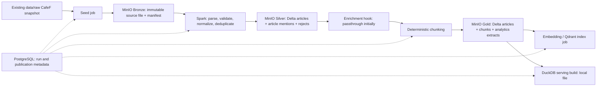

# Local financial-news data architecture

This document describes the local target and records which parts are now implemented. The repository baseline is audited in [repo-audit.md](repo-audit.md); the runnable Phase 02 slice is described in [silver-gold-local.md](silver-gold-local.md). The thesis/cloud diagram remains a long-term target: Azure Data Lake Gen2 can replace MinIO and Kubernetes can replace Docker Compose later. The news transformation rules and dataset contracts must not depend on either deployment choice.

## Current implemented slice

The final CafeF snapshot is imported to MinIO Bronze. Local Spark reads it into the Phase 01 Silver Delta articles, article associations, and rejects. Phase 02 reads Silver by configured URI, writes Gold documents and chunks as Delta in MinIO, and builds three Gold analytical Parquet datasets. A real local FastEmbed model projects Gold chunks into the existing persistent Qdrant service; a separate DuckDB job publishes only the committed Gold analytical manifest to a local file. Each job has an independent Makefile command and metrics in MinIO. The no-op enrichment boundary keeps `entities` null. PostgreSQL run metadata and Airflow orchestration remain future target elements, so the diagram and tables below include planned interfaces beyond the runnable slice.

## End-to-end path

Run the seed, Silver, Gold, Qdrant, and DuckDB jobs as independent commands with explicit input/output locations. PostgreSQL tracks job runs, dataset versions, counts, and publication state; **Delta tables and immutable Bronze objects hold the data**. Qdrant and DuckDB are rebuildable serving projections of a recorded Gold version. No crawler, Airflow, Kafka, Kubernetes, or cloud service is required for this path. Airflow comes after each job independently passes its own tests and a full local replay.

## Storage and execution choices

| Role | Local choice | Later replacement boundary |
|---|---|---|
| Raw object storage | MinIO using S3 API; immutable `bronze/{source}/{batch_id}/...` objects and manifest | Azure Data Lake Gen2 adapter / URI configuration. |
| Batch processing | Spark local or standalone Docker container; one job per stage | Different Spark deploy mode, same transformation code and contracts. |
| Curated tables | Delta Lake under MinIO, with `_delta_log` stored alongside data | Cloud object URI and credentials; same Delta semantics. |
| Operational metadata | Local Docker PostgreSQL | Managed PostgreSQL with the same small control schema. |
| Semantic search | Local Docker Qdrant | Remote Qdrant endpoint/credentials. |
| Analytical serving | One local `.duckdb` file and published views/tables | New analytical adapter, without changing Gold computation. |
| Containers | Docker Compose, using a minimal pipeline subset/profile | Kubernetes manifests later, without changing job entry points. |

MinIO endpoint, bucket, path prefix, credentials, TLS/path-style settings; Spark master and Delta/S3 connector settings; PostgreSQL DSN; Qdrant endpoint/collection; and DuckDB file path are **configuration**, not constants in transformation code. Validate exact Spark/Delta/S3A dependency compatibility during implementation before fixing versions. The DuckDB builder should read **published Gold Parquet exports or a verified Delta reader**; do not assume a direct Delta read works in the selected DuckDB version. Ensure the export corresponds to one committed Gold version before publishing a DuckDB file.

## Data contracts and identity

The first Bronze import uses `data/raw/cafef_news_raw_final.json` once. A manifest records `batch_id`, source filename, SHA-256, bytes, row count, ingestion time, schema version, and object URI. Re-importing an identical checksum must be idempotent. The original bytes remain unchanged; parsing errors are captured downstream. Earlier overlapping snapshots are retained locally but are not additional seed batches by default.

**Raw observation** is one JSON array element. Preserve its source row position, original `_id`, original `post date`, nested export `metadata`, keyword, and ticker fields as lineage. The source adapter maps `ticket symbol` → `ticker_symbol`, `ticket name` → `ticker_name`, and `post date` → `published_at_raw`. It derives `source` from the URL host under an allowlist and canonicalizes URLs without losing the original URL. The meaning of export `metadata.Date`/`Time` is unverified; it is not used as article publication time.

Silver cleaning includes schema and quality validation, conservative HTML/text cleanup, Unicode NFC and whitespace normalization, timestamp normalization, source/ticker metadata normalization, URL normalization, content hashing, and deduplication. Define fixture-based checks for each rule before translating existing Python behavior to Spark. Proposed Silver tables (Delta under MinIO):

| Table | Grain / key | Core fields |
|---|---|---|
| `silver.articles` | One current article per `(source, canonical_url)`; stable `article_id` from that key | original/canonical URL, title, summary, cleaned text, content hash, original and parsed publication date, parser status, source batch/row, processing version. |
| `silver.article_mentions` | Distinct `(article_id, ticker_symbol, keyword)` observation; retain one or more lineage rows when repeated | ticker name, source batch/row, search page/index; nullable values represented consistently. |
| `silver.rejects` | One failed source observation or failed field parsing event | batch/row, raw object reference, reason code, field, diagnostic text; avoid silently dropping data. |

The 15,457 raw observations are expected to yield **at most** 12,698 URL-level articles after validation, while mentions can exceed the article count. These are audit baselines, not acceptance values for Silver. If two URLs share a content hash, keep both article identities initially and flag them as candidate content duplicates. Select a canonical article version deterministically (for example, completeness then stable source row order), while collecting **all** ticker/keyword mentions. Parse timestamps with explicit CafeF formats; a value such as `16:44 PM` must be flagged or handled by a documented rule, with `published_at_raw` preserved and no assumed UTC offset. Silver text rules should follow the existing NFC/whitespace/boilerplate behavior with regression examples; do not mutate Bronze.

The enrichment hook accepts a versioned Silver article contract and returns structured attributes plus `enrichment_status`, `enricher_name`, and `enricher_version`. The initial adapter is **passthrough** and creates no NER dependency. A future ViFinNER adapter can be attached without rewriting ingestion, Silver, or chunking. Failures should be recorded per article without losing the cleaned article.

Proposed Gold tables (Delta under MinIO):

| Table | Grain / key | Core fields |
|---|---|---|
| `gold.articles` | One article per `article_id` and publication version | cleaned article, resolved ticker/keyword arrays or linked mention table, enrichment fields/status, source URL, publication date, lineage. |
| `gold.chunks` | One chunk per `(article_id, article_version, chunker_version, chunk_index)` | stable `chunk_id`, content, position, title/URL, source, ticker list, keyword list, publication date, content hash. |
| `gold.article_tickers` or export view | One article/ticker pair | Dates and measures needed for ticker and time analytics. |
| `gold.pipeline_quality` or export view | One run/source/reason grouping | Input/accepted/rejected counts and publication version for DuckDB quality views. |

Chunk output must include the version of text and splitting rules. A changed article or chunker setting produces a new logical chunk set and triggers deletion of obsolete Qdrant points for that article/version. The current splitter can supply behavior, but its parameters must be explicit and tests must verify deterministic ordering, length, and overlap. Gold remains useful without vectors; embedding is a separate projection job. The embedding model name, vector dimension, model revision, and indexing run belong in the Qdrant manifest/payload. Qdrant point IDs should derive from versioned `chunk_id` plus embedding model; the index job reconciles point count and removes stale points.

DuckDB is built from one published Gold version into a temporary local file, validated, and then atomically made current. Expected views include daily article counts, articles by ticker, source, and publication date, plus quality/rejection counts. These analytical datasets can later feed Power BI without making Power BI a local runtime dependency. Prefer explicit Gold exports with a manifest to avoid mixing Delta versions. The DuckDB file is disposable and can be rebuilt; it is not a replacement for Silver/Gold.

## Interfaces and job boundary

Keep narrow ports at I/O boundaries, with configuration injected into jobs:

| Port | Responsibilities | Local adapter |
|---|---|---|
| `ObjectStore` | Put/read/list immutable objects; checksums and manifests | MinIO S3 API. |
| `TableStore` | Read/commit/version Delta tables | Spark + Delta on MinIO. |
| `RunRegistry` | Begin/finish jobs, lock or reject concurrent publish, record counts/versions | PostgreSQL. |
| `Enricher` | Enrich a versioned article batch or pass through | Passthrough first. |
| `VectorIndex` | Upsert/delete/reconcile versioned chunk vectors | Existing Qdrant adapter refactored. |
| `AnalyticalPublisher` | Build/verify/publish serving tables | DuckDB local file. |

Spark transformations consume DataFrames and contracts, not MinIO client objects, PostgreSQL sessions, or Qdrant calls. Object URIs and credentials are resolved at job startup. This is a boundary, not a requirement to create a large abstraction framework. A job must report input batch/version, output version, counts, rejects, duration, and error status. Replaying the same batch and transformation version must not duplicate articles, mentions, chunks, Qdrant points, or analytics rows.

## Local readiness sequence

1. Bring up only the services needed for the relevant job: MinIO and Spark, then PostgreSQL/Qdrant when their jobs are ready. DuckDB is a local file, not a network service.
2. Import the checked-in final CafeF snapshot into immutable Bronze and record its manifest.
3. Run Spark Silver and validate schema, counts, deduplication, mention preservation, and rejections.
4. Run passthrough enrichment, chunking, and Gold independently; verify Delta history and replay behavior.
5. Build the DuckDB file from a pinned Gold version. Index Qdrant if an embedding provider is configured; confirm retrieval points map back to Gold chunks.
6. Only after a full replay succeeds, introduce Airflow to call the same job entry points. Existing Prefect flows remain historical until migration is deliberately planned.

The specific implementation milestones and evidence gates are in [implementation-plan.md](implementation-plan.md).
