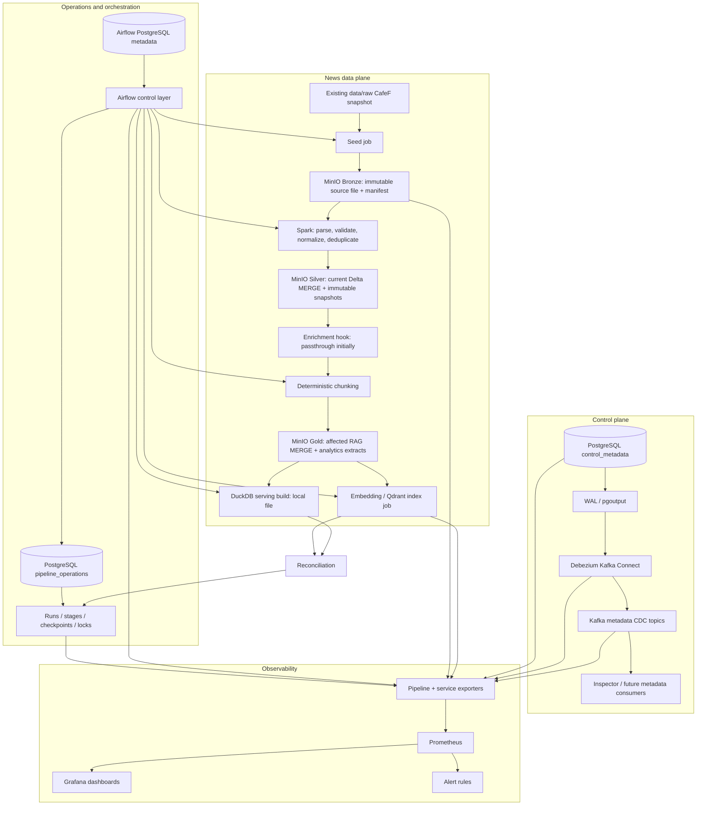

# Local financial-news data architecture

This document describes the implemented local release and labels future targets separately. The repository baseline is audited in [repo-audit.md](repo-audit.md); the runnable data jobs are described in [bronze-silver-local.md](bronze-silver-local.md) and [silver-gold-local.md](silver-gold-local.md); Phase 03 orchestration is documented in [airflow-local.md](airflow-local.md); Phase 04 control metadata CDC is documented in [metadata-control-plane.md](metadata-control-plane.md); Phase 05 incremental operations are documented in [pipeline-operations.md](pipeline-operations.md); Phase 06 release operation is documented in [local-release.md](local-release.md); and Phase 07 monitoring is documented in [monitoring-observability.md](monitoring-observability.md).

## Status boundary

**IMPLEMENTED LOCAL (`local-rc1`):** Docker Compose, MinIO/S3A, Spark 3.5.3,
Delta 3.2.1, Airflow LocalExecutor, PostgreSQL, Debezium, one Kafka broker,
Qdrant, DuckDB, bootstrap/reset tooling, deterministic acceptance fixtures,
derived-store rebuild tests, Prometheus, provisioned Grafana dashboards, and
read-only/native metrics exporters. Phase08 adds five bounded public HTTP source
crawlers, immutable Landing and persistent crawler state, with a default-manual
Airflow DAG; it does not deploy cloud services.

**FUTURE CLOUD TARGET:** ADLS Gen2 or approved storage, scalable Spark, managed
or Kubernetes Airflow/PostgreSQL/Kafka/Qdrant, workload identity, and Kubernetes
deployment. No Azure resource, Kubernetes manifest, Terraform, Helm, or cloud
credential exists in Phase 06. See [cloud-migration-plan.md](cloud-migration-plan.md).

## Current implemented slice

The final CafeF snapshot is imported to MinIO Bronze. Local Spark reads it into the Phase 01 Silver Delta articles, article associations, and rejects. Phase 02 reads Silver by configured URI, writes Gold documents and chunks as Delta in MinIO, and builds three Gold analytical Parquet datasets. A real local FastEmbed model projects Gold chunks into the persistent Qdrant service; a separate DuckDB job publishes only the committed Gold analytical manifest. Each job retains an independent Makefile command and metrics in MinIO. The no-op enrichment boundary keeps `entities` null. Phase 03 runs these entrypoints through Airflow 2.11.2. Phase 04 adds a separate control plane in which PostgreSQL metadata changes flow through Debezium to compacted Kafka topics. Phase 05 adds current-state Silver/Gold Delta tables, affected-record merges, PostgreSQL run/checkpoint/lock state, restartable CLI and Airflow execution, reconciliation, and health checks. Phase 07 reads those operational records and native service endpoints into Prometheus, provisions six Grafana dashboards, and evaluates 12 local alert rules without changing transformation behavior.

## End-to-end path

```mermaid
flowchart TB
    subgraph CP[Control plane]
        MPG[(PostgreSQL control_metadata)] --> WAL[WAL / pgoutput]
        WAL --> DBZ[Debezium Kafka Connect]
        DBZ --> KF[Kafka metadata CDC topics]
        KF --> MC[Inspector / future metadata consumers]
    end
    subgraph OP[Operations and orchestration]
        AP[(Airflow PostgreSQL metadata)] --> AF[Airflow control layer]
        AF --> PR[(PostgreSQL pipeline_operations)]
        PR --> CK[Runs / stages / checkpoints / locks]
    end
    subgraph DP[News data plane]
        A[Existing data/raw CafeF snapshot] --> B[Seed job]
        B --> C[MinIO Bronze: immutable source file + manifest]
        C --> D[Spark: parse, validate, normalize, deduplicate]
        D --> E[MinIO Silver: current Delta MERGE + immutable snapshots]
        E --> F[Enrichment hook: passthrough initially]
        F --> G[Deterministic chunking]
        G --> H[MinIO Gold: affected RAG MERGE + analytics extracts]
        H --> I[Embedding / Qdrant index job]
        H --> J[DuckDB serving build: local file]
    end
    subgraph OB[Observability]
        EX[Pipeline + service exporters] --> PM[Prometheus]
        PM --> GF[Grafana dashboards]
        PM --> AR[Alert rules]
    end
    AF --> B
    AF --> D
    AF --> G
    AF --> I
    AF --> J
    I --> RC[Reconciliation]
    J --> RC
    RC --> CK
    CK --> EX
    AF --> EX
    MPG --> EX
    DBZ --> EX
    KF --> EX
    C --> EX
    I --> EX
```

Run the seed, Silver, Gold, Qdrant, and DuckDB jobs either independently or through Airflow with explicit input/output locations. Airflow PostgreSQL tracks orchestration state, while small status artifacts in MinIO link run IDs to existing metrics; **Delta tables and immutable Bronze objects hold the data**. Qdrant and DuckDB are rebuildable serving projections of a recorded Gold version. Kafka carries only source/pipeline metadata and is not part of the news article data path. No crawler, stock stream, Kubernetes, or cloud service is required for this path.

## Storage and execution choices

| Role | Local choice | Later replacement boundary |
|---|---|---|
| Raw object storage | MinIO using S3 API; immutable `bronze/{source}/{batch_id}/...` objects and manifest | Azure Data Lake Gen2 adapter / URI configuration. |
| Batch processing | Spark local or standalone Docker container; one job per stage | Different Spark deploy mode, same transformation code and contracts. |
| Curated tables | Delta Lake under MinIO, with `_delta_log` stored alongside data | Cloud object URI and credentials; same Delta semantics. |
| Control metadata | PostgreSQL 17 schema `control_metadata`; WAL publication restricted to two tables | Managed PostgreSQL with the same small control schema. |
| Pipeline operations | Separate PostgreSQL schema `pipeline_operations` for runs, stage attempts, checkpoints, and partition locks; excluded from metadata CDC | Managed PostgreSQL or another transactional run registry behind the same repository boundary. |
| Metadata CDC | Debezium 3.3.2.Final and one Kafka 4.1.0 KRaft broker | Managed Kafka/Connect or equivalent CDC runtime; same event contract. |
| Semantic search | Local Docker Qdrant | Remote Qdrant endpoint/credentials. |
| Analytical serving | One local `.duckdb` file and published views/tables | New analytical adapter, without changing Gold computation. |
| Containers | Docker Compose, using a minimal pipeline subset/profile | Kubernetes manifests later, without changing job entry points. |
| Orchestration | Airflow 2.11.2, LocalExecutor, dedicated PostgreSQL metadata DB | Managed/cloud Airflow later; the same standalone job entrypoints remain. |
| Observability | Prometheus, provisioned Grafana, pipeline/postgres/Kafka/Airflow exporters, native MinIO/Qdrant metrics and host metrics | Managed or clustered metric services with the same low-cardinality operational contract. |

MinIO endpoint, bucket, credentials, provider/scheme; Spark master and provider-specific filesystem settings; PostgreSQL DSN; Qdrant endpoint/collection; and DuckDB file path are **configuration**, not constants in transformation code. `Settings.object_uri()` resolves logical keys, `create_object_store()` selects byte access, and `configure_storage()` selects Spark filesystem settings. Spark 3.5.3, Delta 3.2.1, and Hadoop AWS 3.3.4 are pinned and regression tested. The DuckDB builder reads only the exact Parquet objects in a committed Gold Analytics manifest before atomic publication.

## Data contracts and identity

The first Bronze import uses `data/raw/cafef_news_raw_final.json` once. A manifest records `batch_id`, source filename, SHA-256, bytes, row count, ingestion time, schema version, and object URI. Re-importing an identical checksum must be idempotent. The original bytes remain unchanged; parsing errors are captured downstream. Earlier overlapping snapshots are retained locally but are not additional seed batches by default.

**Raw observation** is one JSON array element. Preserve its source row position, original `_id`, original `post date`, nested export `metadata`, keyword, and ticker fields as lineage. The source adapter maps `ticket symbol` → `ticker_symbol`, `ticket name` → `ticker_name`, and `post date` → `published_at_raw`. It derives `source` from the URL host under an allowlist and canonicalizes URLs without losing the original URL. The meaning of export `metadata.Date`/`Time` is unverified; it is not used as article publication time.

Silver cleaning includes schema and quality validation, conservative HTML/text cleanup, Unicode NFC and whitespace normalization, timestamp normalization, source/ticker metadata normalization, URL normalization, content hashing, and deduplication. Fixture tests cover the transformation rules. Implemented Silver tables (Delta under MinIO):

| Table | Grain / key | Core fields |
|---|---|---|
| `silver.articles` | One current article per `(source, canonical_url)`; stable `article_id` from that key | original/canonical URL, title, summary, cleaned text, content hash, original and parsed publication date, parser status, source batch/row, processing version. |
| `silver.article_mentions` | Distinct `(article_id, ticker_symbol, keyword)` observation; retain one or more lineage rows when repeated | ticker name, source batch/row, search page/index; nullable values represented consistently. |
| `silver.rejects` | One failed source observation or failed field parsing event | batch/row, raw object reference, reason code, field, diagnostic text; avoid silently dropping data. |

The 15,457 raw observations are expected to yield **at most** 12,698 URL-level articles after validation, while mentions can exceed the article count. These are audit baselines, not acceptance values for Silver. If two URLs share a content hash, keep both article identities initially and flag them as candidate content duplicates. Select a canonical article version deterministically (for example, completeness then stable source row order), while collecting **all** ticker/keyword mentions. Parse timestamps with explicit CafeF formats; a value such as `16:44 PM` must be flagged or handled by a documented rule, with `published_at_raw` preserved and no assumed UTC offset. Silver text rules should follow the existing NFC/whitespace/boilerplate behavior with regression examples; do not mutate Bronze.

The enrichment hook accepts a versioned Silver article contract and returns structured attributes plus `enrichment_status`, `enricher_name`, and `enricher_version`. The initial adapter is **passthrough** and creates no NER dependency. A future ViFinNER adapter can be attached without rewriting ingestion, Silver, or chunking. Failures should be recorded per article without losing the cleaned article.

Implemented/serving Gold datasets under MinIO:

| Table | Grain / key | Core fields |
|---|---|---|
| `gold.articles` | One article per `article_id` and publication version | cleaned article, resolved ticker/keyword arrays or linked mention table, enrichment fields/status, source URL, publication date, lineage. |
| `gold.chunks` | One chunk per `(article_id, article_version, chunker_version, chunk_index)` | stable `chunk_id`, content, position, title/URL, source, ticker list, keyword list, publication date, content hash. |
| `gold.article_tickers` or export view | One article/ticker pair | Dates and measures needed for ticker and time analytics. |
| `gold.pipeline_quality` or export view | One run/source/reason grouping | Input/accepted/rejected counts and publication version for DuckDB quality views. |

Chunk output must include the version of text and splitting rules. A changed article or chunker setting produces a new logical chunk set and triggers deletion of obsolete Qdrant points for that article/version. The current splitter can supply behavior, but its parameters must be explicit and tests must verify deterministic ordering, length, and overlap. Gold remains useful without vectors; embedding is a separate projection job. The embedding model name, vector dimension, model revision, and indexing run belong in the Qdrant manifest/payload. Qdrant point IDs should derive from versioned `chunk_id` plus embedding model; the index job reconciles point count and removes stale points.

DuckDB is built from one published Gold version into a temporary local file, validated, and then atomically made current. Expected views include daily article counts, articles by ticker, source, and publication date, plus quality/rejection counts. These analytical datasets can later feed Power BI without making Power BI a local runtime dependency. Prefer explicit Gold exports with a manifest to avoid mixing Delta versions. The DuckDB file is disposable and can be rebuilt; it is not a replacement for Silver/Gold.

## Interfaces and job boundary

Keep narrow ports at I/O boundaries, with configuration injected into jobs:

| Port | Responsibilities | Local adapter |
|---|---|---|
| `ObjectStore` | Put/read/list immutable objects; checksums and manifests | MinIO S3 API. |
| `TableStore` | Read/commit/version Delta tables | Spark + Delta on MinIO. |
| `RunRegistry` | Begin/finish jobs, lock or reject concurrent publish, record counts/versions | PostgreSQL. |
| `Enricher` | Enrich a versioned article batch or pass through | Passthrough first. |
| `VectorIndex` | Upsert/delete/reconcile versioned chunk vectors | Existing Qdrant adapter refactored. |
| `AnalyticalPublisher` | Build/verify/publish serving tables | DuckDB local file. |

Spark transformations consume DataFrames and contracts, not MinIO client objects, PostgreSQL sessions, or Qdrant calls. Object URIs and credentials are resolved at job startup. This is a boundary, not a requirement to create a large abstraction framework. A job must report input batch/version, output version, counts, rejects, duration, and error status. Replaying the same batch and transformation version must not duplicate articles, mentions, chunks, Qdrant points, or analytics rows.

## Local readiness sequence

1. Bring up only the services needed for the relevant job: MinIO and Spark, then PostgreSQL/Qdrant when their jobs are ready. DuckDB is a local file, not a network service.
2. Import the checked-in final CafeF snapshot into immutable Bronze and record its manifest.
3. Run Spark Silver and validate schema, counts, deduplication, mention preservation, and rejections.
4. Run passthrough enrichment, chunking, and Gold independently; verify Delta history and replay behavior.
5. Build the DuckDB file from a pinned Gold version. Index Qdrant if an embedding provider is configured; confirm retrieval points map back to Gold chunks.
6. Start Airflow and run the scheduler-managed smoke path; confirm the Silver quality gate triggers Gold and both serving branches pass. Existing Prefect flows remain historical and unused for this medallion slice.
7. Start the metadata control plane, inspect the publication/slot/topics, and run the CDC lifecycle plus restart smoke test. Keep these events separate from news articles and future stock-market topics.
8. Run the Phase 05 incremental CLI or DAG for an explicit `(source, processing_date)`, inspect PostgreSQL stage state, and require reconciliation before its checkpoint advances. Use `make pipeline-health` for the full local slice.
9. Run `make monitoring-up`, then `make monitoring-test`. Inspect the provisioned overview, operations, data-quality, freshness, CDC, and resource dashboards. Use `make phase7-acceptance` to demonstrate Qdrant, data-quality, and Debezium failure/recovery behavior.

The specific implementation milestones and evidence gates are in [implementation-plan.md](implementation-plan.md).

## Phase08 multisource input extension

Verified source-specific crawlers for CafeF, VnExpress, Tuổi Trẻ, Thanh Niên and Báo Mới feed immutable MinIO Landing. Source adapters emit the existing JSON-array Bronze boundary. The existing Spark/Delta Silver, enrichment hooks, Gold and serving jobs are reused. See [crawler architecture](crawling-architecture.md), [operations](crawler-operations.md) and [mapping matrix](source-mapping-matrix.md).

Crawler state is in `crawler_operations`; configuration is in the existing `control_metadata.news_sources.config`. Kafka remains metadata-only. Airflow DAG `news_crawling_pipeline` uses source-level `crawl -> publish` groups, default manual fixture mode and no schedule. Optional live scheduling requires an explicit environment flag. Live and fixture processing versions/serving are separate; each source has its own Qdrant collection and DuckDB file to match existing reconciliation semantics. No cloud implementation was introduced.

Daily scheduling can use `0 6 * * *` in the DAG's `Asia/Ho_Chi_Minh` timezone after explicit live opt-in. Current scheduled capacity is one article per source per run; cadence does not guarantee complete listing/archive coverage. The frontier decides new/retry/recheck work, observation hashes suppress unchanged downstream batches, and pending batches resume through the Phase05 runner. Gold Analytics remains full refresh. Phase08 adds one dashboard/three rules to the Phase07 baseline, giving seven dashboards/15 rules. See [crawler operations](crawler-operations.md#daily-live-scheduling-operator-opt-in) for exact commands and parameter behavior.

Future migration must preserve Landing and `crawler_operations` alongside Bronze/Silver/Gold, `control_metadata` and `pipeline_operations`. See [migration manifest](cloud-migration-manifest.md) for a consistent cutover checkpoint. ADLS adapter/runtime/identity work remains unimplemented and the historical credential release gate stays `NOT READY`.
