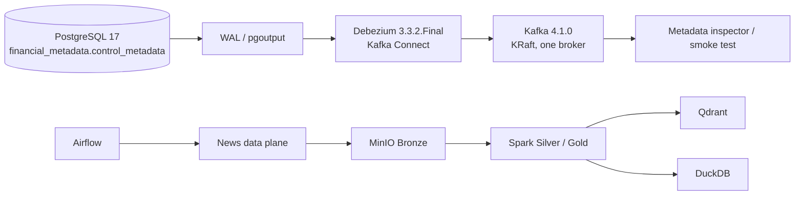

# Phase 04: local metadata CDC control plane

## Purpose and boundary

Phase 04 stores source and pipeline configuration as relational metadata and emits its changes through PostgreSQL WAL, Debezium, and Kafka. Kafka carries only control metadata in this phase. The news data plane remains MinIO Bronze → Spark → Delta Silver/Gold → Qdrant/DuckDB, and Airflow remains the orchestration layer.



Airflow does not consume Kafka and Kafka does not carry news articles. Phase 04 leaves the static Phase 03 DAGs unchanged.

## PostgreSQL schema and migration

The existing domain PostgreSQL service is reused. It remains separate from `airflow-postgres` and the Prefect database. Migration `0001_control_metadata` creates:

### `control_metadata.news_sources`

| Column | Type / rule |
|---|---|
| `source_id` | `varchar(128)` primary key |
| `source_name` | nonblank `varchar(255)` |
| `source_type` | nonblank `varchar(64)` |
| `enabled` | non-null boolean |
| `base_url`, `description` | optional text |
| `config` | JSONB object; no secrets |
| `created_at`, `updated_at` | timezone-aware timestamps |

### `control_metadata.pipeline_configs`

| Column | Type / rule |
|---|---|
| `config_id` | `varchar(128)` primary key |
| `pipeline_name` | nonblank `varchar(128)` |
| `source_id` | foreign key to `news_sources`, delete restricted |
| `enabled` | non-null boolean |
| `config_version` | positive integer |
| `parameters` | JSONB object |
| `created_at`, `updated_at` | timezone-aware timestamps |

Update triggers maintain `updated_at`; both tables use `REPLICA IDENTITY FULL`. Migration history is stored in `public.metadata_control_schema_migrations`. Apply or inspect migrations with:

```bash
make metadata-migrate
docker compose run --rm metadata-tools python3 -m src.metadata_control.migrations status
```

`make metadata-migrate-down` reverts the latest table migration. Stop/delete the connector and remove the publication first when intentionally tearing down a live CDC environment; downgrade is a development operation.

The idempotent seed creates `cafef.vn` and `financial-news-local-v1`. Rerunning it does not overwrite the source `enabled` flag and does not issue an UPDATE when managed fields are unchanged.

## Logical replication

PostgreSQL starts with `wal_level=logical`, ten WAL senders, ten replication slots, and a configurable slot WAL cap. The bootstrap creates a dedicated login/replication role from `METADATA_CDC_USER` and `METADATA_CDC_PASSWORD`, grants only database connect, schema usage, and SELECT on the two captured tables, and creates:

- Publication: `metadata_cdc_publication`
- Slot: `metadata_cdc_slot`, created by Debezium with `pgoutput`
- Database/schema: `financial_metadata.control_metadata`
- Captured tables: `news_sources`, `pipeline_configs`

Airflow, article, RAG, embedding, and analytics tables are excluded. Inspect the actual publication and slot:

```bash
make metadata-db-status
```

## Kafka and Debezium

Kafka 4.1.0 runs as one KRaft broker. Internal containers use `kafka:9092`; host access defaults to the configured advertised host and port `29092`. Metadata topics are:

- `platform.control_metadata.news_sources`
- `platform.control_metadata.pipeline_configs`

Both are explicitly created with one partition and `cleanup.policy=compact`. Kafka Connect uses separate internal topics named `metadata.connect.configs`, `metadata.connect.offsets`, and `metadata.connect.status`.

The connector is `metadata-control-plane`. Its runtime-generated configuration uses `snapshot.mode=initial`, `publication.autocreate.mode=disabled`, `slot.drop.on.stop=false`, JSON without schemas, stable primary-key message keys, and tombstones enabled. Credentials come from `.env` and are redacted from registration output; no password is committed in connector JSON.

Initial startup snapshots rows that exist before connector registration using operation `r`, then continues from WAL. A normal restart resumes from Kafka Connect offsets and the retained PostgreSQL slot. Deleting the connector does not delete the slot. Deleting its offsets and slot causes a later `initial` registration to take a new snapshot.

## Setup and inspection

Copy `.env.example` to `.env` and set at least a non-placeholder `METADATA_CDC_PASSWORD`, then run:

```bash
make metadata-up
make metadata-db-status
make debezium-status
make kafka-topics
```

Inspect bounded event summaries without dumping connector credentials:

```bash
make metadata-consume
```

The consumer prints topic, key, operation, entity, changed fields, before/after values, timestamp, counts, errors, latest offsets, and latest event timestamp.

## Reproducible CDC demo

The automated proof uses dedicated temporary rows and leaves the seed untouched:

```bash
make metadata-cdc-test
```

It verifies WAL/publication/slot state, observes both seed snapshot events, then proves INSERT, UPDATE (`enabled: true → false` and `false → true`, both with before/after), DELETE, and tombstone. It restarts Kafka Connect and proves a second lifecycle at later offsets. It then commits a PostgreSQL row while Kafka is stopped, restarts Kafka, and proves the retained change reaches the topic. Finally, it restarts PostgreSQL and proves connector reconnection with another lifecycle. Results are written under `artifacts/metadata-cdc-*.json`.

A manual update can be demonstrated with the configured database credentials:

```bash
docker compose exec postgresql sh -c 'psql -U "$POSTGRES_USER" -d "$POSTGRES_DB" -c "UPDATE control_metadata.news_sources SET enabled = false WHERE source_id = '\''cafef.vn'\'';"'
docker compose run --rm metadata-tools python3 -m src.metadata_control.consumer --from-beginning --timeout 15 --max-events 200
docker compose exec postgresql sh -c 'psql -U "$POSTGRES_USER" -d "$POSTGRES_DB" -c "UPDATE control_metadata.news_sources SET enabled = true WHERE source_id = '\''cafef.vn'\'';"'
docker compose run --rm metadata-tools python3 -m src.metadata_control.consumer --from-beginning --timeout 15 --max-events 200
```

## Verified local evidence

The full `make metadata-cdc-test` run on 2026-09-23 completed successfully:

- initial snapshots for both seeded tables were observed at partition 0, offset 0;
- the normal lifecycle produced INSERT, `true → false`, `false → true`, DELETE, and tombstone at offsets 29–33;
- after Kafka Connect restart, a new lifecycle continued at offsets 34–38 without another snapshot;
- a PostgreSQL transaction committed while Kafka was stopped and its INSERT appeared at offset 39 after Kafka recovered;
- after PostgreSQL restart, a new lifecycle appeared at offsets 44–48 and the logical slot returned to active state.

Machine-readable evidence is stored in:

- `artifacts/metadata-cdc-smoke.json`
- `artifacts/metadata-cdc-recovery.json`
- `artifacts/metadata-cdc-kafka-recovery.json`
- `artifacts/metadata-cdc-postgres-recovery.json`

## Failure and recovery behavior

- If Kafka is unavailable, PostgreSQL transactions still commit independently. Kafka Connect cannot publish and exposes connection failures in `docker compose logs debezium`; WAL remains retained by the slot up to configured PostgreSQL limits.
- After Kafka Connect restart, connector config and offsets are restored from compacted internal topics. The smoke test verifies subsequent offsets without a new snapshot.
- After PostgreSQL restart, Docker health gates database access and Debezium reconnects to the retained slot. The smoke test verifies new events afterward.
- An invalid connector configuration is visible as `FAILED` through `make debezium-status`; registration and wait commands exit nonzero instead of reporting success.
- PostgreSQL constraints reject blank stable names, non-object JSON configuration, invalid references, and nonpositive config versions before CDC.

Use these commands for diagnosis:

```bash
docker compose ps postgresql kafka debezium
docker compose logs --tail=200 debezium kafka postgresql
make debezium-status
make metadata-db-status
make kafka-topics
```

## Delivery and security limits

The local flow demonstrates ordered single-partition metadata events and durable restart recovery. Consumers must still assume at-least-once delivery and possible replay. It does not claim end-to-end exactly-once processing.

Kafka uses plaintext networking for the local Docker network, Kafka Connect REST has no authentication, and secrets come from the local ignored `.env`. Production requires managed secrets, TLS/authentication, stricter network controls, backups, multi-broker Kafka, connector monitoring, and WAL retention alerts.

No crawler, Kafka-triggered Airflow, dynamic DAGs, stock producer, Flink, Kubernetes, cloud deployment, frontend, Power BI, LLM generation, chatbot, or recommendation system was added.
