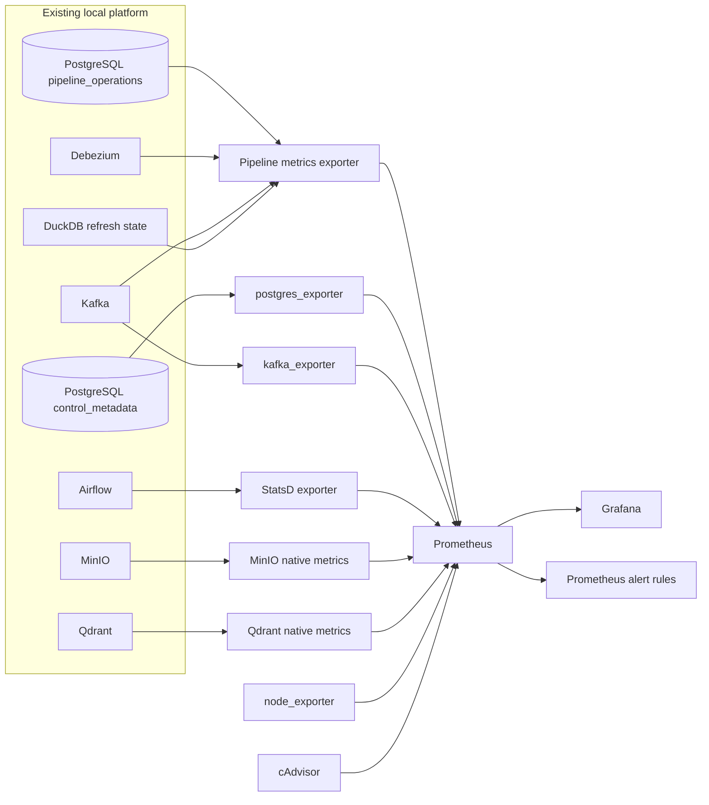

# Local monitoring and observability

This runbook describes the Phase 07 monitoring plane for the local financial-news
platform. It observes the existing Phase 01–06 data and control planes without
moving transformation logic into monitoring services.

## Architecture



Prometheus is the local metrics source of truth and retains seven days by
default. Grafana is provisioned from repository files. Metrics volumes survive
`make monitoring-down`; a Docker volume deletion removes the retained local
history.

## Metrics sources

| Area | Source | Examples |
|---|---|---|
| Pipeline | Read-only `platform-metrics-exporter` over `pipeline_operations` | run status/count/duration, stage attempts/duration, record counts |
| Data quality | Existing stage metrics in PostgreSQL | invalid/duplicate counts, quality gate and reconciliation result |
| Freshness | latest successful stage completion in PostgreSQL | Bronze, Silver, Gold, Qdrant and DuckDB age |
| DuckDB | existing publish-stage metadata | last refresh, row count, operational state |
| Debezium | Connect REST queried by the pipeline exporter | connector and task state |
| Kafka | `kafka_exporter` plus a bounded exporter topic probe | broker health, topic offsets, metadata consumer lag, latest CDC event |
| PostgreSQL | `postgres_exporter` and replication-slot query | availability, connections, transactions, database size, CDC slot state/lag |
| Airflow | Airflow native StatsD output through `statsd_exporter` | scheduler, DAG, task and executor metrics exposed by Airflow 2.11.2 |
| MinIO | native Prometheus endpoint | health, capacity and request metrics |
| Qdrant | native `/metrics` endpoint | availability, request and collection metrics |
| Host/container | `node_exporter` and cAdvisor | CPU, memory, filesystem, network and cgroup observations |

The exporter listens on `:9108` and provides `/metrics` and `/health`. Its
PostgreSQL session sets `default_transaction_read_only=on`. The
`monitoring_exporter` role has `pg_monitor` and `SELECT` only on the two local
platform schemas; it has no replication, role, database, or superuser rights.

### Freshness and success semantics

Layer freshness is:

```text
current Prometheus scrape time - latest successful corresponding stage finish time
```

It does not use object modification time. A completed-run success rate in the
dashboard divides successful runs by successful plus failed runs. Running jobs
are excluded. Pipeline duration measures the runner interval from `started_at`
to `finished_at`; Airflow scheduling delay remains a separate Airflow metric.

Record counts are transformation observations. Bronze input, Silver output,
rejects, duplicates, Gold documents/chunks, Qdrant points and analytics rows do
not need to be equal. Reconciliation metrics encode the expected relationships.

## Prometheus and Grafana

Prometheus configuration and rules live under `monitoring/prometheus/`. The
default host URL is <http://localhost:9090>. The following jobs are required by
the smoke test:

- `pipeline-exporter`
- `postgresql`
- `kafka`
- `airflow-statsd`
- `minio`
- `qdrant`

Prometheus, cAdvisor and node exporter are also scraped. Retention is controlled
by `PROMETHEUS_RETENTION`, with a local default of `7d`.

Grafana is at <http://localhost:3000>. The administrator name and password come
from `GRAFANA_ADMIN_USER` and `GRAFANA_ADMIN_PASSWORD`. Local anonymous Viewer
access lets smoke tests and thesis demos read dashboards; do not carry this
setting into an exposed environment. The Prometheus datasource and all
dashboards are provisioned from `monitoring/grafana/provisioning/`.

## Dashboards

| Dashboard | Purpose |
|---|---|
| Financial News Platform — Overview | service state, pipeline status, last success/failure and Silver/Gold freshness |
| Financial News Pipeline — Operations | runs, success ratio, duration, attempts, input/output, backfill and reprocess |
| Financial News Pipeline — Data Quality | invalid/duplicate records, quality gate, schema and reconciliation observations |
| Financial News Pipeline — Freshness | Bronze through serving publication timestamps and age |
| Metadata Control Plane — CDC | Kafka, metadata topics, Debezium, CDC timestamps and PostgreSQL slot |
| Local Infrastructure — Resources | host CPU, memory, filesystem and network from node exporter |

The CDC dashboard covers only PostgreSQL metadata control events. Financial-news
article content is not transported through Kafka.

## Alert rules

The repository provisions 12 local rules:

| Rule | Local condition |
|---|---|
| `ServiceDown` | required scrape target down for 20 seconds |
| `QdrantDown` | Qdrant scrape target down for 20 seconds |
| `DebeziumConnectorDown` | connector or task down for 20 seconds |
| `KafkaConsumerLagHigh` | selected metadata/demo group lag above 100 for 2 minutes |
| `PipelineRunFailed` | failed run recorded within 10 minutes |
| `PipelineNoSuccessfulRunRecently` | no successful run for 48 hours |
| `SilverDataStale` | Silver operational freshness above 48 hours |
| `GoldDataStale` | Gold operational freshness above 48 hours |
| `QdrantIndexFailure` | failed Qdrant stage recorded within 10 minutes |
| `DataQualityGateFailed` | quality gate failed or an invalid row was observed |
| `ReconciliationFailed` | latest reconciliation did not pass |
| `PostgreSQLReplicationSlotInactive` | CDC slot inactive for one minute |

These are development thresholds for a static local dataset, not production
SLAs. Phase 07 uses Prometheus rule state for the demo and does not configure an
external Alertmanager receiver.

## Start, test, and stop

Prepare local configuration once:

```bash
cp .env.example .env
# Replace every change-me/changeme placeholder in .env.
```

Then run:

```bash
make monitoring-up
make monitoring-health
make monitoring-test
make monitoring-baseline
```

The complete destructive failure-injection acceptance is:

```bash
make phase7-acceptance
```

It uses an isolated source, object prefix, Qdrant collection and DuckDB file.
It still stops Qdrant briefly and pauses the configured Debezium connector, so
run it when interrupting local semantic search and CDC for a few minutes is
acceptable. It restores both dependencies and verifies recovery.

Follow or stop the monitoring services with:

```bash
make monitoring-logs
make monitoring-down
```

`monitoring-down` does not delete Prometheus or Grafana volumes.

## Failure demonstrations

`tools/phase7_acceptance.py` performs three reproducible scenarios:

1. **Data quality:** an isolated malformed row reaches Silver rejects. The
   invalid metric increases and `DataQualityGateFailed` fires while valid rows
   follow the Phase 05 policy.
2. **Qdrant down:** Qdrant is stopped, the downstream stage fails, pipeline and
   service alerts appear, then the same run resumes after Qdrant restarts.
3. **CDC down:** the connector is paused, its alert appears while Kafka and
   PostgreSQL remain healthy, then the connector resumes and the alert clears.

Generated evidence is written under `artifacts/phase7-*` and is ignored by Git.
The checked-in fixtures under `tests/fixtures/monitoring/` do not modify the
canonical CafeF snapshot.

## Cardinality and security

Labels are bounded to configured pipeline names, sources, canonical stages,
statuses, trigger types, known record kinds, layers, components and the two
metadata topics. Unknown pipeline/source/stage values map to `other`.

The exporter never labels series with `run_id`, `article_id`, `chunk_id`, URL,
error text, stack trace, SQL, or credential values. Run IDs remain in structured
operational logs and PostgreSQL for diagnosis. `tools/monitoring.py acceptance`
audits the active metric labels for these forbidden names.

Passwords remain environment values. Prometheus and Grafana provisioning files
contain no real credentials. Exported database metrics do not include query
text. Local ports and anonymous Grafana viewing assume a developer machine and
must be restricted before any shared deployment.

## Troubleshooting

```bash
docker compose ps
docker compose logs --tail=200 prometheus grafana platform-metrics-exporter
docker compose exec prometheus promtool check config /etc/prometheus/prometheus.yml
curl -fsS http://localhost:9090/api/v1/targets
curl -fsS http://localhost:9108/health
curl -fsS http://localhost:3000/api/health
```

If startup reports that `METADATA_CDC_PASSWORD` is missing, create `.env` from
the example and provide local development values. If Grafana has stale
dashboards, restart it so file provisioning runs again. If the exporter reports
collection failure, verify the monitoring role exists by rerunning
`make metadata-up`, then inspect exporter logs.

On the verified Docker/cgroup-v2 host, cAdvisor exposes host cgroups without
stable Compose container-name labels. The resource dashboard therefore uses
node exporter for an honest host baseline. Per-service CPU/memory remains a
known local limitation. Existing Loki/Fluent Bit configuration belongs to a
legacy scraper logging path and is not part of the Phase 07 metrics-first gate.

## Later cloud mapping

| Local component | Later deployment boundary |
|---|---|
| Prometheus container and local TSDB volume | managed Prometheus or durable cluster Prometheus |
| Grafana container and provisioned JSON | managed/self-hosted Grafana with the same dashboard source |
| pipeline exporter | stateless deployment with read-only access to the operations database |
| postgres/kafka exporters | exporters or managed-service metric integrations |
| Airflow StatsD | managed Airflow metrics endpoint or approved telemetry collector |
| MinIO/Qdrant native metrics | corresponding managed storage/vector-service metrics |
| node exporter/cAdvisor | Kubernetes node/kube-state/container metrics in a later phase |

This mapping is documentation only. Phase 07 creates no cloud resource,
Kubernetes manifest, Terraform, Helm, or external notification integration.

## Thesis evaluation use

The dashboards show end-to-end and per-stage duration alongside volume,
quality, freshness and host resource observations. This supports repeatable
local demonstrations of normal processing, dependency failure, quality failure
and recovery. Baseline values and their limits are recorded in
[local-monitoring-baseline.md](local-monitoring-baseline.md).

## Phase08 crawler observability

The existing exporter now optionally reads `crawler_operations` through the existing read-only monitoring role. It remains compatible with pre-crawler databases. Metrics: `financial_news_crawler_runs_total`, `financial_news_crawler_articles_total`, `financial_news_crawler_last_duration_seconds`, `financial_news_crawler_last_success_timestamp_seconds`, `financial_news_crawler_frontier_urls`, `financial_news_crawler_pending_batches`. Labels use only fixed source keys, fixture/live kind, bounded statuses and outcome categories. URLs/article IDs/crawl-run IDs are not labels.

The seventh provisioned dashboard is **Financial News — Multisource Crawling** (`news-crawler`). Three additional local alerts bring the ruleset to 15: `CrawlerSourceBlocked`, `CrawlerParserFailures`, `CrawlerDownstreamBacklog`. Thresholds/windows live in the rules configuration. These crawler alerts target live observations; manual crawling has no freshness SLA. Gauge totals represent retained operational history and can decrease if that history is explicitly removed.

Run `make crawler-monitoring-smoke` for actual exporter series, Prometheus rule-loading and Grafana provisioning checks; `make test-monitoring` includes three crawler cardinality/compatibility tests. If a long-lived bind mount retains an old directory inode, recreate Prometheus/Grafana, then check rules through `promtool` and the API.
