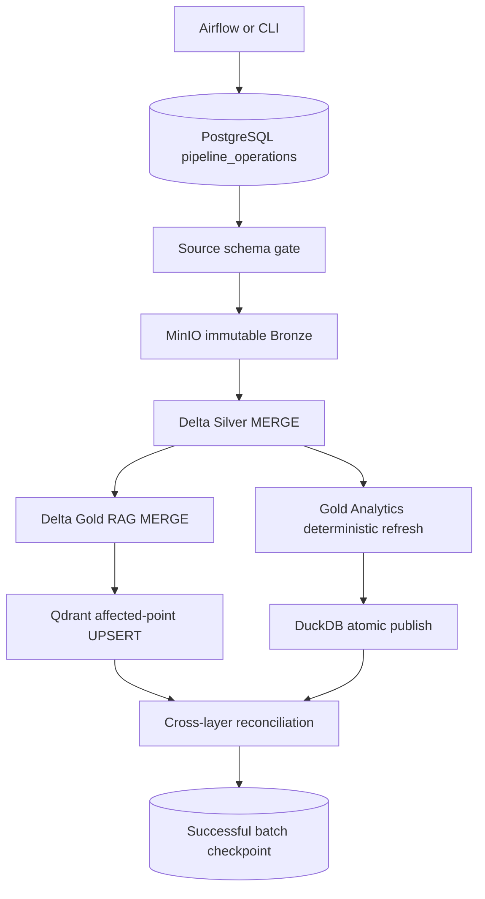

# Phase 05 pipeline operations

This document describes the hardened local financial-news batch pipeline. The implementation remains a batch and incremental batch system. Kafka is still restricted to Phase 04 control metadata; article bodies and chunks do not pass through Kafka.

## Architecture and normal processing



A normal run validates one explicit source file and logical processing date, records the run and each stage in PostgreSQL, and acquires a partition lock. Successful stages are durable and can be reused when the same `run_id` resumes. The checkpoint advances only after every required stage and reconciliation succeeds.

The stage order is:

1. `schema_validation`
2. `bronze_ingest`
3. `silver_merge`
4. `gold_rag_merge`
5. `gold_analytics_refresh`
6. `duckdb_publish`
7. `qdrant_upsert`
8. `reconciliation`

The standalone runner is the implementation boundary. Airflow calls the same runner through a thin parameter adapter and contains no transformation logic.

## Incremental boundary and configuration identity

The logical partition is `(source, processing_date)`. `processing_date` identifies the batch being handled; it is separate from an article's `published_at`. A configuration hash containing the Silver processing version, chunker settings, embedding provider, model, and dimension is appended to the pipeline name. This gives checkpoints and locks the effective key:

```text
(pipeline_name:configuration_hash, source, processing_date)
```

A changed processing, chunking, or embedding configuration therefore cannot silently inherit an incompatible checkpoint. Airflow uses `max_active_runs=1`, and PostgreSQL additionally rejects two different runs that target the same effective partition.

## Storage layout and current processing semantics

### Bronze

Bronze is content addressed and immutable:

```text
bronze/{source}/{source_file_sha256}/raw.json
bronze/{source}/{source_file_sha256}/manifest.json
bronze/partitions/source={source}/processing_date={date}/{source_file_sha256}.json
```

The raw object preserves the exact source bytes. The SHA-256 is the ingestion ID. Replaying identical bytes does not create another raw copy; it creates or reuses a small deterministic logical partition reference. A different processing date may point to the same immutable object.

### Silver

The Phase 01 per-ingestion snapshots remain supported for compatibility. Phase 05 adds current-state Delta tables:

```text
silver/current/{source}/{processing_version}/articles
silver/current/{source}/{processing_version}/article_mentions
silver/current/{source}/{processing_version}/rejects
```

Spark applies the existing normalization and validation logic to the affected Bronze input. It merges articles by `article_id`, merges mentions by `(article_id, ticker_symbol, keyword)`, and inserts rejects by stable source lineage. Metrics distinguish inserted, updated, unchanged, invalid, duplicate, and current row counts.

The immutable affected-ID report for each attempt is stored at:

```text
silver/operations/source={source}/processing_version={version}/
  processing_date={date}/run_id={run_id}/affected_articles.json
```

### Gold RAG

Current documents and chunks are stored at:

```text
gold/current/rag/{source}/{processing_version}/{chunker_version}/documents
gold/current/rag/{source}/{processing_version}/{chunker_version}/chunks
```

Only inserted or changed Silver articles are regenerated after the first bootstrap. Documents merge on `article_id`. Chunks merge on `chunk_id`; obsolete chunks are deleted only within the affected article set. A new chunk configuration uses a different current Gold path and bootstraps all current Silver articles.

### Gold Analytics and DuckDB

Gold Analytics reads current Silver and rewrites the three small aggregate Parquet datasets plus a committed manifest:

```text
gold/current/analytics/{source}/{processing_version}/
```

This is intentionally a deterministic full aggregate refresh. Incremental cube logic would add complexity without a correctness benefit for the current data volume. DuckDB stages the manifest's exact Parquet objects into a temporary database, validates counts, and uses `os.replace` to publish the completed file atomically. A failed refresh leaves durable Gold Analytics and the previous DuckDB file intact.

## Identity and update semantics

`article_id` keeps the approved Phase 01 formula:

```text
SHA-256(source + "\n" + canonical_url)
```

`content_hash` is SHA-256 of normalized article content. An edited article at the same canonical URL retains its `article_id` and updates the current Silver record. Phase 05 keeps current state and does not add temporal article history.

A chunk ID is:

```text
SHA-256(article_id + "\n" + content_hash + "\n" + chunker_version + "\n" + chunk_index)
```

Identical content and settings keep stable chunk IDs. Changed content replaces that article's chunk set. A Qdrant point ID is UUIDv5 over `(embedding model identity, chunk_id)`, so repeated indexing performs stable UPSERTs. The collection dimension is validated; incompatible dimensions fail instead of mixing vectors. A missing or changed model metrics identity triggers reindexing of every current Gold article into the configured collection.

## Removed article policy

Bronze history is always retained. Phase 05 has no upstream deletion/tombstone contract for news articles. If a later partition omits a previously seen URL, the current Silver article, Gold chunks, and Qdrant points remain. Content changes for an observed `article_id` do remove obsolete chunks and vector points for that article. Explicit source deletion is future contract work and must define whether it means invalidation, unpublishing, or legal erasure before hard-delete behavior is added.

## Run metadata, checkpoints, and locks

Migration `operations/migrations/0001_pipeline_operations.up.sql` creates the separate `pipeline_operations` schema:

| Table | Purpose |
|---|---|
| `pipeline_runs` | Run ID, pipeline/config identity, source, trigger type, explicit range, status, parameters, Airflow references, timestamps, and error. |
| `pipeline_stage_runs` | Per-stage attempt, status, input/output lineage, metrics, duration, and error. |
| `pipeline_checkpoints` | Last successful normal/manual partition for `(pipeline_name, source)`. |
| `pipeline_partition_locks` | One active owner for an effective source/date partition. |

Allowed trigger types are `NORMAL`, `BACKFILL`, `REPROCESS`, and `MANUAL`. `REPROCESS` is rejected by the database unless `force_reprocess=true`. Backfills and reprocesses do not move the normal checkpoint. A failed run never advances it. Checkpoints are batch progress state, not event-time or Flink watermarks.

These four operational tables are intentionally absent from `metadata_cdc_publication`, which remains restricted to `control_metadata.news_sources` and `control_metadata.pipeline_configs`. Pipeline metrics therefore do not flood the metadata Kafka topics.

## Commands

Start dependencies and apply the idempotent operations migration:

```bash
make pipeline-services-up
make operations-status
```

Process one explicit logical partition:

```bash
make pipeline-incremental \
  DATE=2026-09-29 \
  SOURCE_FILE=/app/data/partitions/2026-09-29.json \
  RUN_ID=demo-normal-20260929
```

Backfill only an explicit inclusive range. Each file must exist inside the container at `PARTITION_DIR/{date}.json` unless `PARTITION_PATTERN` is changed:

```bash
make pipeline-backfill \
  FROM=2026-09-01 TO=2026-09-07 \
  PARTITION_DIR=/app/data/partitions \
  RUN_ID=demo-backfill-20260901-07
```

Intentionally reprocess an already seen partition. The Make target always passes the required force flag:

```bash
make pipeline-reprocess \
  DATE=2026-09-20 \
  SOURCE_FILE=/app/data/partitions/2026-09-20.json \
  RUN_ID=demo-reprocess-20260920
```

Inspect status or resume a failed run with the same stored partition list and configuration identity:

```bash
make pipeline-status
make pipeline-resume RUN_ID=demo-normal-20260929
```

The runner also works directly through `spark-submit` using the `incremental`, `backfill`, `reprocess --force-reprocess`, and `resume` subcommands in `src/news_pipeline/pipeline_runner.py`.

## Failure recovery

| Failure point | Durable state | Recovery |
|---|---|---|
| Source schema validation | No new Bronze or downstream output | Correct/review the fixture, then start a new run. |
| Bronze or Silver | Earlier successful stage metadata remains; checkpoint unchanged | Resume the same run ID. Successful earlier stages are reused. |
| Gold RAG | Bronze/Silver remain committed | Resume the same run ID; Gold and later stages retry. |
| Analytics or DuckDB | Delta Gold RAG and Gold Analytics written before the failure remain durable; old DuckDB remains current on publish failure | Resume, or run `make analytics-rebuild`. |
| Qdrant | Durable Gold, Analytics, and DuckDB remain available; run and Qdrant stage are `FAILED` | Restore Qdrant and resume the same run. Upstream successful stages are reused. |
| Reconciliation | All derived outputs remain inspectable; checkpoint unchanged | Repair/rebuild the failing projection, reconcile, then resume. |

A run ID is unique. Supplying an existing failed run ID automatically resumes it; `make pipeline-resume` makes that intent explicit. A resumed partition can reacquire its own lock. Another run is rejected while the lock exists.
Before changing the stored run back to `RUNNING`, resume verifies that the current source and all data-shaping processing, chunking, and embedding settings match the recorded configuration. Service endpoints may change during outage recovery without changing data identity.

## Reconciliation and quality gates

Run cross-layer reconciliation with the active configuration:

```bash
RUN_ID=manual-reconcile-20260929 make pipeline-reconcile
```

The report is written to `operations/reconciliation/{run_id}.json` in MinIO. It checks:

- unique Silver `article_id` values;
- unique Gold document IDs and chunk IDs;
- exact Silver-to-Gold document membership;
- chunk-to-document references;
- exact stable Qdrant point IDs, including missing and stale points;
- DuckDB article total against the published analytics manifest.

The source gate checks the approved JSON array shape, exact known fields and types, required transformation fields, and nested `metadata.Date`/`metadata.Time` fields before Bronze ingestion. Unsafe unknown or mismatched fields fail the run and do not rewrite `docs/data-contracts.md`. Silver and Gold retain the Phase 01/02 required-field, normalization, uniqueness, and relationship gates. Missing optional author/category/image values remain allowed by contract.

## Derived-store rebuild

Both serving systems are disposable projections of durable Gold:

```bash
# Re-embed all current Gold chunks and reconcile the configured collection.
make qdrant-rebuild INDEX_LIMIT=0

# Recompute current aggregate Parquet and atomically replace DuckDB.
make analytics-rebuild
```

Set `NEWS_SOURCE`, `NEWS_PROCESSING_VERSION`, `NEWS_QDRANT_COLLECTION`, embedding settings, and `NEWS_DUCKDB_PATH` when rebuilding a nondefault configuration. Changing embedding dimension requires a compatible empty/new Qdrant collection. Changing chunk size or overlap selects another versioned Gold path and requires rechunking from current Silver.

## Metrics and structured logs

Every application log event is JSON and includes its event name, UTC timestamp, level, run ID, stage, source/partition where applicable, status, lineage, counts, and duration. It does not log article bodies, embeddings, or credentials.

Stage metrics include:

- Bronze: records and bytes seen, stable ingestion ID, raw and partition-reference keys;
- Silver: input, valid/output, invalid, duplicate, inserted, updated, unchanged, current articles, mentions, and duration;
- Gold RAG: affected articles, run/total documents and chunks, replaced chunks, empty articles, and duration;
- Analytics/DuckDB: input articles, aggregate row counts, published manifest/file, and duration;
- Qdrant: affected articles, input/embedded/indexed points, failures, stale deletions, collection total, model/dimension, and duration;
- reconciliation: every relationship count, check result, and report key.

Use `make pipeline-status` for persisted run/stage state.

## Health check

With local services running and the environment pointing at an existing current dataset:

```bash
make pipeline-health
```

It returns nonzero if MinIO, current Silver Delta, Qdrant, DuckDB, PostgreSQL schemas, Kafka, Debezium connector/task, or Airflow scheduler/metadatabase is unhealthy. It is a developer/demo check rather than a monitoring platform.

## Airflow incremental DAG

`news_incremental_pipeline` exposes `incremental`, `backfill`, `reprocess`, and `resume` parameters and calls the standalone runner in one retryable Spark task. The DAG is serial with `max_active_runs=1` and one retry. No dataset is passed through XCom.

The default schedule is disabled because the checked-in sample does not create a new source fixture every day. Set a real fixture-producing schedule explicitly, for example:

```bash
AIRFLOW_NEWS_INCREMENTAL_SCHEDULE='@daily' make airflow-up
```

A scheduled run uses the logical date as `processing_date`; the corresponding source file must exist or the run fails clearly. Manual runs can supply `source_file`, `from_date`, `to_date`, `partition_dir`, `file_pattern`, `force_reprocess`, and `pipeline_run_id` in DAG config.

## Automated verification

```bash
make data-contracts-check
make test-idempotency
make test-incremental
make test-backfill
make airflow-test
METADATA_CDC_PASSWORD='<local-test-secret>' make metadata-cdc-test
```

`make test-idempotency` and `make test-incremental` share the isolated Phase 05 Spark integration suite. `make test-backfill` runs the CLI recovery suite. `make phase5-test` combines contract drift, Phase 05 correctness/recovery, and DAG import tests.

Evidence is stored in:

- `artifacts/phase5-integration-results.json`
- `artifacts/phase5-recovery-results.json`
- `artifacts/phase5-performance-baseline.json`

## Local performance baseline

The canonical CafeF file contains 15,457 observations and 83,333,360 bytes. On the recorded i7-12700H/16.45 GB local Docker environment with Spark `local[2]`, first Bronze write took 2.75 s, Silver took 42.292 s, Gold chunking took 30.258 s, analytics took 19.821 s, and DuckDB publication took 0.084 s. The Phase 02 Qdrant smoke embedded/indexed 96 of 66,260 chunks in 26.1 s. Its limit means the summed 121.305 s is a bounded sequential observation, not a full-vector end-to-end benchmark or production capacity claim.

The final isolated Phase 05 integration run covers idempotent rerun, one new article, one changed article, stale-vector removal, mismatch detection, repair, and lock/checkpoint behavior. Exact timings and environment caveats are in `artifacts/phase5-performance-baseline.json` and the integration artifact.

## Limitations

- Current Silver and Gold keep current state; there is no temporal article-version table.
- Omission from a later input does not delete a previous article. Explicit invalidation/deletion needs a contract.
- Gold Analytics uses a correct full refresh rather than affected-partition aggregate updates.
- Delta uses a local single-driver S3 log store and the operations lock assumes all writers honor the runner; this is suitable for the local slice.
- The local PostgreSQL, Kafka, Qdrant, and Airflow services use development defaults. Kafka is a single plaintext broker.
- PostgreSQL run/checkpoint state and MinIO/Delta commits are not one distributed transaction. Stage records plus reconciliation provide recovery after a partial commit.
- Qdrant and DuckDB remain derived stores and can temporarily lag durable Gold during an outage.
- Airflow scheduling requires an external process to place dated source fixtures; crawler work remains out of scope.
- Local timings include container startup, warm caches, and shared-laptop load.
